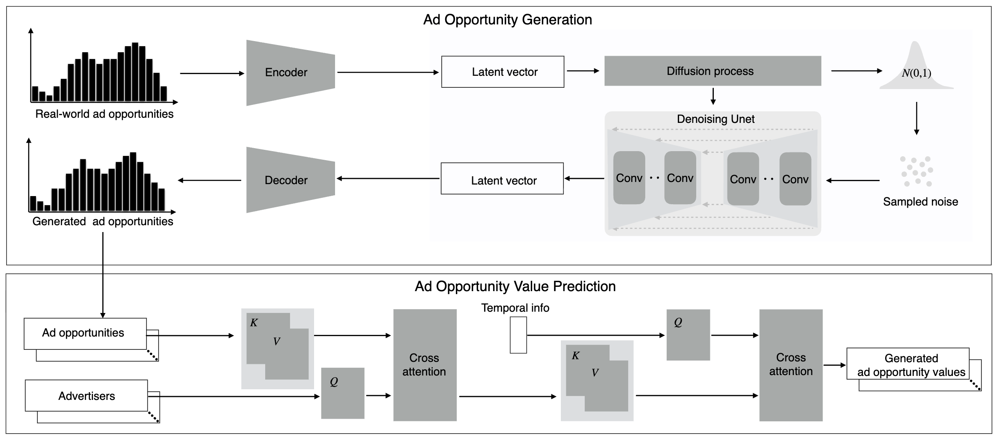

# AuctionNet: A Novel Benchmark for Decision-Making in Large-Scale Games 論文読解の軌跡

> 論文を読みながら出た疑問と、それに対する Claude の解説を話題ごとに記録する。
> 翻訳は同じフォルダの `翻訳.md`、原文は PDF を参照。

## 目次

- [用語の定義](#glossary)
- [話題1：Abstract の読解](#t1)
  - [質問１：「AuctionNet は3つの部分から構成される」の意味](#t1-q1) → [回答１](#t1-a1)
  - [質問２：広告主ごとの「欲しい広告枠」の違いはどう考慮されているか](#t1-q2) → [回答２](#t1-a2)
- [話題2：第2章 問題の定式化（POSG）](#t2)
  - [質問１：POSG とは何か、タプルの各記号は何を表すのか](#t2-q1) → [回答１](#t2-a1)
  - [質問２：状態 s とは何か](#t2-q2) → [回答２](#t2-a2)
- [話題3：「最適な入札額は価値に比例する」とはどういうことか](#t3)
  - [質問１：この一文は当たり前のことを言っているのか、なぜ比例が最適なのか](#t3-q1) → [回答１](#t3-a1)
  - [質問２：比例が最適だと分かると、何が便利なのか](#t3-q2) → [回答２](#t3-a2)
- [話題4：第5章 ベースラインは α をどう決めているか](#t4)
  - [質問１：成績が最も良かった Online LP は、α をどう決めているのか](#t4-q1) → [回答１](#t4-a1)
- [話題5：AuctionNet を修士論文の題材にできるか](#t5)
  - [質問１：「問題 → 仮説 → 検証 → 結果」の形の修士論文にするのは難しいか](#t5-q1) → [回答１](#t5-a1)
- [話題6：第2章「1時間ステップでの相互作用」の段落（状態と観測）](#t6)
  - [質問１：この段落は何を言っているのか](#t6-q1) → [回答１](#t6-a1)
- [話題7：第2章 オークション結果・報酬・予算の更新の式](#t7)
  - [質問１：オークション結果 x、報酬の式、次の予算の式は何を意味しているのか](#t7-q1) → [回答１](#t7-a1)
- [話題8：第2章 式 (1) エージェントの最適化目的](#t8)
  - [質問１：式 (1) は何を意味しているのか](#t8-q1) → [回答１](#t8-a1)
- [話題9：第3章 Figure 2 広告機会生成ネットワークのパイプライン](#t9)
  - [質問１：Figure 2 の説明文と図は何を意味しているのか](#t9-q1) → [回答１](#t9-a1)
- [話題10：事前生成データセット（約80GB）の正体](#t10)
  - [質問１：何が入っていて、何のためにあり、なくても実験できるのか](#t10-q1) → [回答１](#t10-a1)
  - [質問２：記録から学習する手法は、計算量が多すぎると言えるのか](#t10-q2) → [回答２](#t10-a2)
- [話題11：第4章の概要](#t11)
  - [質問１：第4章は何を言っているのか。生成データの内容の妥当性の話か](#t11-q1) → [回答１](#t11-a1)
- [話題12：第5章 ベースライン5手法は、何を最適化し、どう α を決めるのか](#t12)
  - [質問１：何を最適化するのかから、5手法の違いまで](#t12-q1) → [回答１](#t12-a1)

---

<a id="glossary"></a>

# 用語の定義

この文書で使う言葉の意味を、ここで固定します。回答の中で言い回しが揺れていたら、こちらが正です。金額の例は説明用で、論文に「円」という単位が出てくるわけではありません。

| 用語 | 定義 | 単位 | 誰が決めるか | 例 |
|---|---|---|---|---|
| 広告機会 | ある1人のユーザ（視聴者）に、広告を1回見せるチャンス | 件 | ユーザが来ると発生する | 1日に50万件以上 |
| 購入 | 広告を見たユーザが、購入などの成果に至ること。論文の用語ではコンバージョン。この文書の「成果」も同じ意味 | 件 | ユーザの行動 | |
| 価値 $v$ | その広告機会で広告を見せたとき、購入に至る**確率**。「クリックされる確率 × クリック後に購入に至る確率」で計算する。**お金は含まない** | 確率（0〜1） | 環境の価値予測モデルが計算し、入札前にエージェントに渡す | 0.002（0.2%） |
| 係数 $\alpha$ | **購入1件を得るためにかけてよい広告費の上限**。「商品が1個売れるごとに、広告費を最大いくらまでかけてよいか」 | 円／購入1件 | エージェントが、ステップごとに1つ決める | 5,000円 |
| 入札額 $b$ | **広告機会1件**（広告を1回見せる権利）に、いくらまで払ってよいか。$\alpha$ × 価値 で決まる | 円／広告機会1件 | $\alpha$ と価値から自動的に決まる | 5,000円 × 0.002 = 10円 |
| 値段 | その広告機会での、ライバルの最高入札額。落札した広告主が実際に払う金額。論文の用語ではコスト $c$ | 円／広告機会1件 | ライバルの入札で決まる | 8円 |
| CPA | 実績の、購入1件あたりの広告費。支払いの合計 ÷ 購入件数 | 円／購入1件 | 競りの結果で決まる | 10万円 ÷ 40件 ＝ 2,500円 |
| CPA 上限 | 広告主が決める、CPA の上限。超えるとスコアが減点される（採点式は話題12） | 円／購入1件 | 広告主ごとに固定 | 2,000円 |
| 方策 | 「今の状況を見て、α をいくつにするか」を決めるルールや仕組み。強化学習の用語で、この文書では「手法の中身」とほぼ同じ意味 | | 手法ごとに異なる | |
| 事前生成データセット | シミュレータの中で48体の自動入札エージェントを1日ずつ競わせ、その競りの全記録を保存したもの。実際の広告プラットフォームの記録ではない | 約5億行 | 著者が作成済み。外部からダウンロードする | |
| 軌跡 | 1体のエージェントの1日分の「状況 → α → 報酬」を、ステップ順に並べたもの。学習に使う形 | 48ステップ分 | 記録から変換して作る | |
| 特徴量 | ものの性質を数字で表したもの。ここでは、ユーザの年齢層、性別、会員レベル、過去の購入額などを数字にしたもの。論文の $u$ | 数字の並び | 実データ、または生成モデルが作る | 年齢層 3、会員レベル 5、先月の購入額 1.2万円、… |
| 潜在ベクトル | 特徴量の要点だけを、短い数字の並びに圧縮したもの。生成モデルの内部で使う | 数字の並び | エンコーダが作る | |
| オークション結果 $x$ | 広告機会ごとに、落札できたかどうかを 1（落札）か 0（負け）で表したもの | 1 か 0 | 競りの結果で決まる | 落札、負け、落札、負け なら (1, 0, 1, 0) |
| インプレッション | 落札して、広告が実際にユーザに表示される1回分。この文書では「落札した広告機会」とほぼ同じ意味で使う | 件 | 競りの結果で決まる | |
| 予算 $\omega$ | 1エピソード（1日）に払える金額の合計の上限 | 円／1日 | 広告主が最初に決める | 10万円 |
| 購入1件あたりの広告費 | 値段 ÷ 価値。その広告機会を買い続けたときに、購入1件を得るのにかかる見込みの広告費。安いほどコスパが良い。$\alpha$ がこれ以上なら落札できる | 円／購入1件 | 値段と価値から決まる | 8円 ÷ 0.002 = 4,000円 |
| 報酬 | 1ステップで落札できた広告機会の、価値の合計 | 見込みの購入件数 | 競りの結果で決まる | 0.002 + 0.010 + … |

### 取り違えやすい点

**価値は確率であり、金額や単価は入っていない**

価値は「クリックされる確率 × クリック後に購入に至る確率」で、掛け合わせているのは2つとも確率です。商品の単価のような金額は含まれていません。金額の話が入ってくるのは、$\alpha$ を掛けて入札額にするときです。

なお、「購入に至る確率が 0.002」と「見込みの購入件数が 0.002 件」は同じ数字の2通りの読み方です。0.2% の確率で購入される広告機会を1,000件落札すれば、見込みの購入件数は 0.002 × 1,000 = 2件になります。報酬の単位が「見込みの購入件数」なのはこのためです。

**α と入札額は、何1件あたりの金額かが違う**

どちらも「広告費をいくらまでかけてよいか」という金額ですが、対象が違います。

| | 何に対する金額か | 例 |
|---|---|---|
| $\alpha$ | **購入1件**に対して | 商品が1個売れるごとに、広告費を最大 5,000円までかけてよい |
| 入札額 | **広告を1回見せること**に対して | この視聴者に1回見せるためなら 10円まで払う |

広告を1回見せても、購入されるとは限りません。0.2% の確率でしか購入されないなら、購入1件を得るには平均して500回見せる必要があります。購入1件を得るための広告費の上限が5,000円なら、500回分で5,000円までなので、1回見せることにかけてよいのは 5,000円 ÷ 500 = 10円です。これが「入札額 = $\alpha$ × 価値」（5,000円 × 0.002 = 10円）の意味です。

競りに出す金額は入札額の方です。競りは広告機会1件ごとに行われるので、「購入1件あたり5,000円」という $\alpha$ の数字をそのまま競りに出すことはありません。

**入札額と値段は別のもの**

入札額は「ここまでなら払ってよい」という上限で、実際に払うのは値段（ライバルの最高入札額）です。入札額が値段以上なら落札でき、値段の分を払います。

---

<a id="t1"></a>

# 話題1：Abstract の読解

<a id="t1-q1"></a>

## ユーザからの質問内容１

Abstract の次の一文が何を言っているのか分からない。この分野に詳しくない読者にも分かるように説明してほしい。

> AuctionNet は3つの部分、すなわち広告オークション環境、その環境に基づく事前生成データセット、そして複数のベースライン入札意思決定アルゴリズムの性能評価から構成される。

<a id="t1-a1"></a>

## claudeの回答１

この一文は「AuctionNet という研究用の道具セットには、3つのものが入っています」という中身の紹介です。先に結論を書くと、3つは次のように言い換えられます。

| 論文の言い方 | やさしく言うと |
|---|---|
| 広告オークション環境 | 広告の競りを再現した**シミュレータ**（仮想の競り会場） |
| その環境に基づく事前生成データセット | そのシミュレータを動かして録っておいた**対戦記録** |
| ベースライン入札意思決定アルゴリズムの性能評価 | よく知られた手法をそこで動かしたときの**成績表** |

以下、前提から順に説明します。

### 前提：広告オークションと「入札意思決定」

Web ページやアプリを開くと広告が表示されます。あの広告枠は、表示のたびに「この人にこの枠で広告を出したい広告主は、いくら払いますか」という**競り（オークション）**にかけられています。この「広告を出せる1回分のチャンス」を論文では**広告機会**と呼びます。

競りは1日に膨大な回数行われるので、人間が毎回値段を決めることはできません。そこで広告主の代わりにプログラムが自動で値段を決めます。これが**自動入札エージェント**です。

- **入札**：競りで「いくら出す」と値段を提示すること
- **入札意思決定**：その値段をどう決めるか、という判断のこと
- **入札意思決定アルゴリズム**：その判断のやり方（計算手順）のこと

予算には限りがあるので、「価値の高いチャンスには高く、低いチャンスには安く、しかも1日の途中で予算を使い切らないように」という配分が難しいところで、ここが研究の対象です。

### そもそも「ベンチマーク」とは

AuctionNet は**ベンチマーク**だと書かれています。ベンチマークとは、いろいろな手法を**同じ条件で比べるための共通の土俵**のことです。

たとえば模擬試験を考えると、全員が同じ問題を解くから点数で比べられます。各自が違う問題を解いていたら、誰が優れているのか分かりません。研究でも同じで、研究者ごとに別々の条件で実験していると、新しい手法が本当に良いのか判断できません。

AuctionNet は、自動入札の研究のためにこの「共通の土俵」を用意したものです。その土俵が3つの部分でできている、というのが質問の一文です。

### 1つ目：広告オークション環境（シミュレータ）

**環境**は、この分野の用語で「アルゴリズムを動かして試すための、仮想の世界」を指します。ここでは、広告の競りをコンピュータの中で再現したシミュレータのことです。

なぜ必要かというと、本物の広告プラットフォームで実験することは普通の研究者にはできないからです。実際のお金が動きますし、データは企業の中にあって外に出せません。そこで、Alibaba の実際の広告プラットフォームを元に、本物に近い動きをするシミュレータを作って公開しました。

このシミュレータの中では、次のことが繰り返されます。

1. 広告を出せるチャンス（広告機会）が発生する
2. 複数の自動入札エージェントがそれぞれ値段を提示する
3. 競りのルールに従って、誰が勝ち、いくら払うかが決まる

自分で作った入札アルゴリズムをここに参加させれば、どれくらい成果が出るかを試せます。運転でいえば、実際の道路に出る前に使うドライビングシミュレータにあたります。

### 2つ目：その環境に基づく事前生成データセット（対戦記録）

**データセット**はデータの集まりのことです。「その環境に基づく」「事前生成」という2つの修飾は、次の意味です。

- **その環境に基づく**：1つ目のシミュレータを動かして作ったデータである
- **事前生成**：使う人が自分で作らなくてよいように、著者たちがあらかじめ作って配っている

つまり、シミュレータの中でたくさんの自動入札エージェントを実際に競わせ、「どのチャンスに、誰が、いくらで入札し、誰が勝って、いくら払ったか」を録った**対戦記録**です。Abstract の続きにある「1,000万件の広告機会、48の自動入札エージェント、5億件を超える記録」がその規模です。

シミュレータがあるのに記録まで配る理由は主に2つあります。

- **手間が省ける**：これだけの量を自分でシミュレートするのは時間がかかります。配られていればすぐ分析や実験に取りかかれます。
- **記録から学ぶ手法がある**：後の章に出てくる IQL や Decision Transformer といった手法は、過去の記録を読み込んで「うまい入札のしかた」を学びます。こうした手法には、学習の材料となる記録が必要です。

将棋でいえば、対局できるソフト（環境）に加えて、過去の対局の棋譜集（データセット）も配っているようなものです。

### 3つ目：ベースライン入札意思決定アルゴリズムの性能評価（成績表）

言葉を分解します。

- **ベースライン**：比較の基準にするための、すでに知られている代表的な手法のこと。「まずこれと比べる」という相手です。
- **入札意思決定アルゴリズム**：前提で説明した、入札の値段の決め方のこと。
- **性能評価**：実際に動かして、どれくらい良い成果が出たかを測ること。

つなげると、「すでに知られている代表的な入札手法をいくつか、このシミュレータで実際に動かして、成績を測った結果」という意味になります。

これがあると、新しい手法を作った研究者は「既存の手法はこの点数だった。自分の手法はそれより上か下か」をすぐに比べられます。基準となる点数がなければ、自分の点数が良いのか悪いのか判断できません。模擬試験でいえば、平均点や過去の受験者の得点分布が公開されているのと同じ役割です。

論文で実際に測られているのは、PID コントローラ、Online LP、IQL、Behavior Cloning、Decision Transformer の5つです（第5章）。

### 3つの関係

3つはバラバラではなく、1つ目を土台にしてつながっています。

```
① 広告オークション環境（シミュレータ）
        │
        ├─ 動かして記録を録る ──→ ② 事前生成データセット（対戦記録）
        │
        └─ 既存手法を動かして測る → ③ ベースラインの性能評価（成績表）
```

研究者の立場から見ると、「②の記録で自分の手法を学習させ、①のシミュレータで実際に動かし、③の成績表と比べて良し悪しを判断する」という一連の流れが、AuctionNet だけで完結します。この一文が言いたいのは、その一式をまとめて提供している、ということです。

<a id="t1-q2"></a>

## ユーザからの質問内容２

広告主には、それぞれ欲しい広告枠の種類があるはずである（たとえば、若年層向けの商品を深夜に広告しても効果は薄い）。こうした広告主ごとの違いは、どのように考慮されているのか。また、Abstract を読んでいる段階では、まだそこまで考えなくてもよいのか。

<a id="t1-a2"></a>

## claudeの回答２

その感覚は正しく、論文でもきちんと考慮されています。仕組みを一言でいうと、**「同じ広告機会でも、広告主ごとに価値の数字が違う」**という形で表現されています。

Abstract にはこの話は出てこないので、今の段階で分からなくて問題ありません。詳しくは第2章と第3.1節に出てきます。ただ、ここを先に押さえておくと後が読みやすくなるので、概要を説明します。

### 仕組み：広告主ごとに違う「価値」

論文では、広告機会の1つ1つに対して、広告主ごとの**価値**という数字が付きます。第2章の記号では $v_{ij}$ と書かれ、「広告主 $i$ にとっての、広告機会 $j$ の価値」という意味です。

ポイントは、この数字が広告機会だけで決まるのではなく、**広告主と広告機会の組み合わせ**で決まることです。同じ1回の広告機会でも、ある広告主には価値が高く、別の広告主には価値が低い、ということが起こります。

価値の中身は、第4.1節で次のように定義されています。

$$\text{value} = \text{pCTR} \times \text{pCVR}$$

- **pCTR**：その広告を見せたら、クリックされそうな確率の予測
- **pCVR**：クリックされたあと、購入などの成果につながりそうな確率の予測

つまり価値とは、「この人に今この広告を見せたら、購入などの成果に至る確率」です。若年層向け商品の広告を、買いそうにない相手や時間帯に出しても成果につながりにくいので、その広告主にとっての価値は低い数字になります。

### 価値が入札額にどう効くか

第2章で、入札額は次の式で決めると書かれています。

$$\text{入札額} = \alpha_i \times v_{ij}$$

$\alpha_i$ は広告主 $i$ のエージェントが決める係数で、「全体としてどれくらい強気に入札するか」を表します。

この式から、**価値が低い広告機会には自動的に低い入札額しか出ない**ことが分かります。低い入札額では競りに勝てないので、結果としてその広告主は、自分に合わない広告機会をほとんど買わないことになります。

数字で例を作ってみます（数字は説明用に私が作ったもので、論文の値ではありません）。

| | 広告機会A の価値 | 広告機会B の価値 |
|---|---|---|
| 広告主X | 0.010 | 0.001 |
| 広告主Y | 0.002 | 0.008 |

両者とも $\alpha = 100$ だとすると、入札額は次のようになります。

| | 広告機会A への入札 | 広告機会B への入札 |
|---|---|---|
| 広告主X | 1.0 | 0.1 |
| 広告主Y | 0.2 | 0.8 |

広告機会A は広告主X が、広告機会B は広告主Y が勝ちます。誰も「この種類の枠が欲しい」と明示的に指定していないのに、価値の数字を通じて、それぞれ自分に合った広告機会に振り分けられています。

つまりエージェントは「どの種類の枠を狙うか」を直接選んでいるのではありません。選り分けは価値 $v_{ij}$ が担い、エージェントが決めるのは係数 $\alpha_i$ だけです。この設計は、「最適な入札額は価値に比例する」という既存研究の結果 [3] に基づいています。

### 価値の数字はどこから来るか

価値を計算するのは、環境の中の**価値予測モデル**です（第3.1節）。このモデルは次の3つを入力にして、pCTR と pCVR を予測します。

- **広告機会の特徴量**：その広告を見ることになるユーザの情報。論文に出てくる例は、Taobao の会員レベル、性別、好みのスマートフォン価格帯、閲覧した商品数、消費金額など
- **広告主のカテゴリ情報**：その広告主がどの業種か
- **時間情報**：1日のうちのどの時間帯か

質問の例にあった「誰に」「どの商品を」「いつ」の3つが、ちょうどこの3つの入力に対応しています。

なお、ここでいう広告機会は「深夜の枠」のような時間帯の枠ではなく、「あるユーザに1回広告を見せるチャンス」という単位です。時間帯は、その1回ごとの価値を左右する要素の1つとして入っています。

**予測モデルは人がルールを書いたものではない**

価値予測モデルは、実際の広告データから学習したニューラルネットワークです。「若年層向け商品は深夜だと価値が低い」といったルールを人が書き込んでいるわけではありません。作り方は次のとおりです。

1. 材料は、Alibaba の実際の広告プラットフォームの記録です。「こういうユーザに、この業種の広告を、この時間帯に見せたときの価値はいくつだったか」という実績が大量にあります。
2. モデルに「ユーザの特徴・広告主の業種・時間帯」を入れて価値を予測させ、実績とのずれが小さくなるように調整を繰り返します（第3.1節の損失 $\mathcal{L}_{\text{pred}}$ が、このずれを表しています）。
3. 学習が済んだモデルに新しい広告機会を入れると、その広告主にとっての pCTR と pCVR が出てきて、掛け合わせたものが価値になります。

pCTR、pCVR の「p」は predicted（予測された）の頭文字です。現実の広告プラットフォームも同じ考え方で、過去の「見せた・クリックされた・買われた」の記録から予測モデルを作り、広告を出すたびに予測しています。

**価値は入札の前に決まっている**

価値は、落札した後に評価して決めるものではありません。広告機会が発生した時点で、広告主ごとの価値がすでに数字として付いていて、エージェントはそれを見てから入札します。だから「$\alpha$ × 価値」で入札額を決められます。

- 価値は確率であり、お金の額ではありません。たとえば価値 0.001 は、「この人にこの広告を見せると、0.1% の確率で購入などの成果に至る」という意味です。商品の単価のような金額は含まれていません。
- 落札できたら、その広告機会の価値がそのまま報酬に加算されます。確率を足し合わせたものは「見込みの購入件数」になるので、エージェントの目的は、予算内で見込みの購入件数をできるだけ大きくすることです。
- 実際には、広告を見せても買ってくれるかどうかは分かりません。この点について論文は、簡単のため「予測は正確である」と仮定する、と断っています（第4.1節）。

**リポジトリのコードでの扱い**

ここまでは論文の説明です。リポジトリのコードでは、価値の作り方が2通りあり、[config/test.gin](../../../github/config/test.gin) の `Controller.pv_generator_type` で切り替えます（コードを読んで確認した内容で、実際に動かしてはいません）。

| 設定値 | 価値の作り方 | ニューラルネットワーク |
|---|---|---|
| `"neuripsPvGen"`（初期設定） | 業種ごと・時間帯ごとの平均とばらつきを決めて、乱数で価値を作る | 使わない |
| `"modelPvGen"` | 論文 第3.1節の価値予測モデルで計算する | 使う |

- 初期設定は NeurIPS のコンペで使われた方式で、[NeurIPSPvGen.py](../../../github/simul_bidding_env/PvGenerator/NeurIPSPvGen.py) の中に平均やばらつきの基準値が数字で書かれています。論文の方式とは違い、手で決めたパラメータと乱数に近い作りです。
- `"modelPvGen"` にすると、同梱されている学習済みの重み（[Pv_latest.pth](../../../github/simul_bidding_env/PvGenerator/model_utils/check_point/PV_model/Pv_latest.pth)、約9MB）を読み込み、手元の PC 上で計算します。既定では CPU で動く作りです。
- ユーザの特徴を作る拡散モデルは、実行時には動きません。著者が生成済みの広告機会 約10.5万件が CSV で同梱されていて、それを価値予測モデルに通します。
- 元になった Alibaba の実データは公開されていないので、価値予測モデルを自分で学習し直して論文と同じものを再現することはできません。
- 事前生成データセットには、計算済みの価値が記録の1項目として入っています。データセットで戦略を評価する場合は、その値を読むだけです。

### 時間帯による違いは論文でも確認されている

時間帯で価値が変わることは、第4.2節の Figure 8 で実際に示されています。カテゴリ（業種）ごとに、1日の中での価値の上がり下がりのパターンが違う、という結果です。論文はここから「エージェントは、最適なタイミングで適切なインプレッションに入札するために、価値の時間変動を考慮すべきである」と述べています。

ここで $\alpha_i$ の役割が出てきます。予算は1日分で決まっているので、自分にとって価値の高い時間帯が後に控えているなら、それまでは $\alpha_i$ を抑えて予算を残しておく、といった調整が必要になります。「どの広告機会が自分向きか」は価値が教えてくれますが、「いつ、どれくらい強気に出るか」はエージェントが考える部分で、これが各アルゴリズムの腕の見せどころです。

### 補足：競合関係も価値から生まれる

第4.2節の Figure 9 では、あるカテゴリと別のカテゴリの価値に正の相関がある例が示されています。これは「同じような広告機会を、両方の業種が欲しがっている」ということで、その2つの業種は競りでぶつかりやすい競合になります。欲しい広告機会が似ている広告主どうしが自然に競争相手になる、という点も価値の数字を通じて表現されています。

### 注意点

翻訳に収録されている本文の範囲では、広告主が「この層には出さない」と条件を直接指定するような仕組み（いわゆるターゲティング設定）は説明されていません。広告主ごとの好みの違いは、すべて価値 $v_{ij}$ の大小として表現されている、と読めます。

---

<a id="t2"></a>

# 話題2：第2章 問題の定式化（POSG）

<a id="t2-q1"></a>

## ユーザからの質問内容１

第2章冒頭の、POSG による定式化の段落が理解できない。POSG という言葉を初めて聞いたので、POSG とは何か、タプル $\mathcal{M} = \{S, A, P, r, \gamma, Z, O, I, T\}$ の各記号が何を表すのかを説明してほしい。

<a id="t2-a1"></a>

## claudeの回答１

この段落は、何か新しい主張をしているわけではありません。「広告の競りを、これからこういう記号で書き表します」という**記号の宣言**です。記号が9個並ぶので難しく見えますが、言っている内容は次の一文にまとまります。

> 広告の競りは、「複数の広告主のエージェントが、競合の懐事情は見えないまま、1日のあいだ何度も入札の強さを決め直していく勝負」として書ける。

こういう勝負を数学的に書くための決まった型が **POSG** です。

### POSG という名前の意味

POSG は Partially Observable Stochastic Game の略で、日本語では「部分観測確率ゲーム」です。3つの言葉は、それぞれ広告の競りの性質に対応しています。

| 言葉 | 広告の競りでいうと |
|---|---|
| ゲーム | 複数の広告主のエージェントが同じ広告機会を競り合う。勝てるかどうかは競合の入札額次第 |
| 確率 | 次の時間帯にどんなユーザが来て、どんな広告機会が発生するかは、事前には分からない |
| 部分観測 | 自分の残り予算は分かるが、競合の残り予算は分からない |

### エピソードとステップ

記号の説明の前に、競りがどう進むかを見ておきます。そのために「エピソード」と「ステップ」という2つの言葉が必要です。

**エピソード**は、「予算を持って始めてから、期間が終わって成果が確定するまで」のひとまとまりです。

- 予算はエピソードの最初に決まり、エピソードを通して使っていきます。
- 次のエピソードは、予算も含めて新しくやり直しになります。
- この論文のデータセットには21エピソードが入っていて、1エピソードに50万件を超える広告機会があります。

論文は1エピソードの長さを明記していませんが、第4.2節で「1日の中での価値の時間変動」を分析しているので、ほぼ「1日分の広告配信」と考えてよさそうです。

**ステップ**は、エピソードを細かく区切った1コマで、エージェントが判断を1回下す単位です。この論文では1エピソードを48ステップに区切っています。1エピソードが1日なら、1ステップは約30分にあたります（これは私の計算で、論文に書かれた数字ではありません）。

1ステップは「広告機会1件」ではない点に注意してください。1ステップの中に平均して1万件以上の広告機会が入っていて、エージェントはそのステップで使う入札の係数 $\alpha$ を1つ決め、ステップ内の広告機会すべてに同じ $\alpha$ で入札します。

ステップに区切る理由は、判断の粒度をちょうどよくするためです。広告機会1件ごとに作戦を変えるのは細かすぎ、1日を通して同じ作戦のままでは状況の変化に対応できません。そこで「約30分ごとに、予算の残り具合やこれまでの結果を見て $\alpha$ を調整し直す」という中間の粒度にしています。

### 登場人物

流れを追う前に、誰が出てくるかを整理します。以下では、**フジテレビの広告枠を、化粧品メーカーA・スポーツブランドB・飲食店Cが競り合う**という場面で説明します。

| 登場人物 | 立場 | この説明での例 |
|---|---|---|
| 広告プラットフォーム | 広告枠を持っている**売り手**で、競りの**開催者**。競り全体の状況を把握している | フジテレビ |
| 広告主 | 広告を出したい**買い手**。自動入札エージェントは広告主の代理 | 化粧品メーカーA、スポーツブランドB、飲食店C |
| ライバル | 同じ広告枠を欲しがっている、他の広告主 | 化粧品メーカーAから見た、スポーツブランドBと飲食店C |
| ユーザ | 広告を見る人 | フジテレビの視聴者 |

この例について、2点だけ断っておきます。

- 論文の実際のプラットフォームはフジテレビではなく Alibaba の通販サイトで、実験ではシミュレータがこの役を務めます。役割の関係（売り手1つに対して、買い手が複数いて競り合う）は同じです。
- 地上波の放送では全員に同じCMが流れますが、ここで考える広告枠は「**ある1人の視聴者が番組を見ている、その1回**」です。ネット配信で、見ている人ごとに違うCMが流れるのを想像してください。この「1人に1回見せるチャンス」が広告機会で、1件ごとにその場で競りにかけられます。

以下の説明では、**全体を見渡しているのはフジテレビだけ**で、各広告主のエージェントは自分に関する部分しか見えない、という区別が大事になります。

### 1ステップで起こること

具体的な場面で、1ステップの流れを追ってみます。いま10:00〜10:30のステップが始まるところだとします。広告主は化粧品メーカーA、スポーツブランドB、飲食店Cで、それぞれ1日分の予算を持って朝から広告を出しています（金額や時刻は説明用に私が置いたものです）。

```
① 10:00 時点の、競り全体の状況（フジテレビが把握している全体像）
   ・全広告主の残り予算（化粧品メーカーA 7万円、スポーツブランドB 3万円、飲食店C 5万円…）
   ・この30分にフジテレビを見る視聴者たち（＝広告機会）と、その特徴
   ・各広告機会が、各広告主にとってどれくらいの価値か
        ↓
② フジテレビが、各エージェントに「その広告主に関する部分だけ」を渡す
   化粧品メーカーAのエージェントに渡されるもの：
   ・自分の残り予算 7万円
   ・広告機会の特徴と、自分にとっての価値
   （スポーツブランドBや飲食店Cの残り予算は渡されない。他のエージェントも同様）
        ↓
③ 各エージェントが、それぞれ入札の強さ α を決める
   「予算が余り気味だから、少し強気にしよう」など
        ↓
④ 全エージェントの入札が出そろい、フジテレビが広告機会ごとに勝者と支払額を決める
   各エージェントは、落札できた広告機会の価値の合計を成果として得る
        ↓
⑤ 各広告主の残り予算が支払った分だけ減り、10:30 からの新しい広告機会がやってくる
   → 次のステップの①へ
```

この一巡を48回繰り返すと、1エピソード（1日）が終わります。

論文の用語は、この①〜⑤に付けられた名前です。

| 上の流れ | 論文の用語 |
|---|---|
| ① 競り全体の状況。フジテレビが把握している全体像 | 状態 |
| ② そのうち、あるエージェントに渡される部分 | 観測 |
| ③ エージェントが決める α | 行動 |
| ④ 落札できた広告機会の価値の合計 | 報酬 |
| ⑤ 予算が減り、次の広告機会が来ること | 状態の遷移 |

状態は**競り全体に1つだけ**あるもので、特定の広告主のものではありません。「化粧品メーカーAの状態」「スポーツブランドBの状態」が別々にあるわけではなく、広告主ごとに別々にあるのは観測の方です。

### 9個の記号の意味

「タプル」は、いくつかのものを並べて1組にしたもの、という意味です。$\mathcal{M} = \{S, A, P, r, \gamma, Z, O, I, T\}$ は「この競りの勝負は、この9個を決めれば定まる」と言っています。

具体的な中身は、この段落の次の段落（状態や行動を説明している部分）の内容に基づいています。

| 記号 | 広告の競りでいうと | 用語 |
|---|---|---|
| $I$ | 競りに参加する自動入札エージェント全員。$\{1, 2, \cdots, n\}$ は「1番から $n$ 番まで」（データセットでは48体） | エージェントの集合 |
| $T$ | 1日を何コマに区切るか。上で説明した「48」 | ホライズン |
| $S$ | 流れの①。競り全体の状況で、全広告主の残り予算、その時間帯の広告機会の特徴、全広告主の特徴（業種など）、価値の表を合わせたもの | 状態空間 |
| $Z$ | 流れの②。あるエージェントに渡される、自分の残り予算、広告機会の特徴、自分にとっての価値など | 観測空間 |
| $O$ | ①から②を取り出すルール。「各エージェントには、自分に関する部分だけを見せる」 | 観測関数 |
| $A$ | 流れの③。入札の強さを決める係数 $\alpha$ | 行動空間 |
| $r$ | 流れの④。落札できた広告機会の価値の合計 | 報酬関数 |
| $P$ | 流れの⑤。落札して支払った分だけ予算が減り、次の時間帯の広告機会がやってくる | 遷移確率 |
| $\gamma$ | 後の時間帯で得る成果を、今の成果よりどれだけ軽く見るか（後述） | 割引率 |

$S$、$A$、$Z$ に付いている「空間」は、「ありうるものを全部集めたもの」という意味です。たとえば行動空間 $A$ は「$\alpha$ としてとりうる値すべて」です。

### 数式の読み方

段落の中に出てくる数式は、どれも「何が決まると、何が決まるか」を表しています。矢印 $\to$ の左が先に決まるもの、右がそこから決まるものです。$\times$ は掛け算ではなく「〜と〜の組」という意味です。

**遷移確率** $P(\cdot \mid s, a) : S \times A \to \Delta(S)$

「10:00 時点の状況（$s$）と、全員が決めた $\alpha$（$a$）が決まると、10:30 時点の状況がどうなりそうかが決まる」という意味です。

$\Delta(S)$ は「1つに確定するのではなく、確率で決まる」ことを表しています。予算がいくら減るかは競りの結果から計算できますが、10:30 以降にどんな視聴者が来るかは事前には分かりません。これが名前の「確率」の部分です。

**観測関数** $O(s, i) : S \times I \to Z$

「10:00 時点の状況（$s$）と、どのエージェントか（$i$）が決まると、そのエージェントに見えるものが決まる」という意味です。

同じ10:00 の状況でも、化粧品メーカーAのエージェントに見えるものと、スポーツブランドBのエージェントに見えるものは違います。これが名前の「部分観測」の部分です。

**個別報酬関数** $r_i(s, a) : S \times A \to \mathbb{R}$

「10:00 時点の状況（$s$）と、全員が決めた $\alpha$（$a$）が決まると、エージェント $i$ がこの30分で得た価値の合計が1つの数値として決まる」という意味です。$\mathbb{R}$ は実数、つまり数値のことです。

**結合行動** $a = (a_1, a_2, \cdots, a_n)$

全エージェントが決めた $\alpha$ を、1番から $n$ 番まで並べたものです。$a_1$ がエージェント1の $\alpha$、$a_2$ がエージェント2の $\alpha$ です。$A = A_1 \times A_2 \times \cdots \times A_n$ は、それを集まりの側で書いたものです。

**結合報酬関数** $r = r_1 \times r_2 \times \cdots \times r_n$

同じように、全エージェント分の成果の決まり方を並べたものです。

### この段落で一番大事なところ

記号の中で、内容として最も重要なのは次の点です。

個別報酬関数 $r_i(s, a)$ で成果を決めているのは、自分の $\alpha$（$a_i$）ではなく、**全員の $\alpha$ を並べた** $a$ です。これは「化粧品メーカーAのエージェントの成果は、自分の $\alpha$ だけでは決まらず、スポーツブランドBや飲食店Cなど他の全員の $\alpha$ にも左右される」ということを表しています。

競りなのでこれは当然の性質です。化粧品メーカーAが同じ金額で入札しても、競合がそれより安ければ落札でき、高ければ落札できません。遷移確率 $P$ も同じく全員の $\alpha$ から決まる形になっていて、自分の予算がどれだけ減るかも競合の入札次第で変わります（支払額は競合の入札額をもとに決まるためです）。

この「競合の入札に結果が左右される」ことと、「競合の懐事情は見えない」ことの2つが、自動入札を難しくしている原因です。わざわざ POSG という型を持ち出しているのは、この2つをきちんと書き表すためです。

第1章で既存研究の AuctionGym が「単一エージェントの視点で、他のエージェントの影響を無視している」と批判されていましたが、POSG で定式化することは、その批判に対する著者たちの答えにもなっています。

### 割引率 γ について

割引率 $\gamma$ は、「後の時間帯で得る成果を、今の時間帯で得る成果よりどれだけ軽く見るか」を表す0から1の間の数です。たとえば $\gamma = 0.9$ なら、1ステップ後（30分後）の成果は0.9倍、2ステップ後の成果は0.81倍に割り引いて数えます。

ただし、この論文の本文で $\gamma$ が実際に使われる場面はほとんどありません。この後に出てくる最適化の目的（式 (1)）は、朝の成果も夜の成果も割り引かずにそのまま足し合わせる形になっています。POSG の型に含まれる部品なので定義には書かれている、という程度に受け取って構いません。

### どこまで理解すれば先に進めるか

記号の細かい書き方を覚える必要はありません。次の3点が分かっていれば、この先を読むのに十分です。

1. 広告の競りを、複数のエージェントが1日のあいだ競い合う勝負として捉えている
2. 各エージェントは、自分の残り予算や自分にとっての価値は分かるが、競合の残り予算は分からない
3. 各エージェントの成果は、全員の入札の強さの組み合わせで決まる

この段落の次の段落から、状態・観測・行動・報酬の中身が、数式を使って順に説明されます。

<a id="t2-q2"></a>

## ユーザからの質問内容２

第2章に出てくる「状態 $s$」とは何か。

<a id="t2-a2"></a>

## claudeの回答２

状態 $s$ は、**ある時点での競り全体の状況を、漏れなく書き出したもの**です。回答１の流れの①「10:00 時点の、競り全体の状況」がそのまま状態にあたります。

状態は競り全体に1つだけあり、全体を把握しているフジテレビ（実験ではシミュレータ）の視点で書かれています。特定の広告主のものではないので、「化粧品メーカーAの状態」というものはありません。全広告主の情報が、ライバルどうしの分も含めて1つにまとまっています。

論文は状態の中身を次の4つだと定義しています。

$$s = (\omega, u, q, v)$$

| 記号 | 中身 | 10:00 時点の例 |
|---|---|---|
| $\omega$ | 各広告主の残り予算 | 化粧品メーカーA 7万円、スポーツブランドB 3万円、飲食店C 5万円 |
| $u$ | このステップに発生する広告機会の特徴。どんな視聴者に広告を見せるチャンスなのか | 1件目は美容番組をよく見る視聴者、2件目はスポーツ中継をよく見る視聴者、3件目はグルメ番組をよく見る視聴者、… |
| $q$ | 各広告主の特徴。業種カテゴリなど | 化粧品、スポーツ用品、飲食 |
| $v$ | 価値の表。どの広告主にとって、どの広告機会が、どれくらいの価値か | 下の表 |

（広告主、金額、視聴者の特徴は説明用に私が置いたものです。論文の実際のデータでは、$u$ は通販サイトの会員レベルや閲覧した商品数といったユーザ情報です。）

### 4つ目の「価値の表」について

$v$ は論文では「価値行列」と呼ばれ、$v = \{v_{ij}\}$ と書かれています。行列とは、数字を縦横に並べた表のことです。行が広告主、列が広告機会で、$v_{ij}$ は「広告主 $i$ にとっての、広告機会 $j$ の価値」です。

| | 広告機会1 | 広告機会2 | 広告機会3 | … |
|---|---|---|---|---|
| 化粧品メーカーA | 0.010 | 0.001 | 0.004 | … |
| スポーツブランドB | 0.002 | 0.008 | 0.003 | … |
| 飲食店C | 0.003 | 0.002 | 0.009 | … |

話題1の回答２で説明した「同じ広告機会でも広告主ごとに価値が違う」という話が、この表の形で状態の中に入っています。実際には1ステップに1万件以上の広告機会があるので、列が1万本以上ある大きな表になります。

### なぜこの4つなのか

この4つがそろえば、そのステップの競りに必要な情報がすべてそろうからです。

- 価値の表 $v$ があれば、各エージェントが $\alpha$ を決めたときに、全員の入札額（$\alpha$ × 価値）が計算できる
- 入札額が出そろえば、広告機会ごとの勝者と支払額が決まる
- 残り予算 $\omega$ があれば、支払った後に予算がいくら残るか、予算切れで入札できなくなるかどうかが分かる
- 広告機会の特徴 $u$ と広告主の特徴 $q$ は、価値を計算するもとになった情報

つまり状態は、「これと全員の $\alpha$ が分かれば、この30分に何が起こるかが決まる」という情報をまとめたものです。回答１で遷移確率や報酬を「10:00 時点の状況と、全員の $\alpha$ が決まると…」と読んだときの「10:00 時点の状況」が、この $s$ です。

### ステップが進むと状態はどう変わるか

状態はステップごとに変わります。10:00 の状態と 10:30 の状態を比べると、次のようになります。

| 記号 | 10:00 → 10:30 での変化 |
|---|---|
| $\omega$（残り予算） | 落札して支払った分だけ減る。論文の式では $\omega_i' = \omega_i - \sum_j x_{ij} c_{ij}$（今の予算から、落札した広告機会のコストの合計を引く） |
| $u$（広告機会の特徴） | まるごと入れ替わる。10:30 からの30分に見ている、別の視聴者たちになる |
| $q$（広告主の特徴） | 変わらない。業種は1日の途中で変わらない |
| $v$（価値の表） | まるごと入れ替わる。新しい広告機会に対する価値になる |

エージェントが自分の行動で直接動かせるのは、このうち残り予算だけです。次にどんな視聴者が来るかは、エージェントには決められません。

### 状態と観測の違い

大事な点として、**状態の全体を見ているエージェントは1体もいません**。全体像を持っているのはフジテレビだけです。

各エージェントに渡されるのは、状態のうち自分に関する部分だけです。論文はこれを観測と呼び、エージェント $i$ の観測を次のように書いています。

$$o_i = (\omega_i, u_i, q_i, v_i)$$

状態の式と見比べると、各記号に $i$ が付いただけです。$i$ が付くと「全員分」が「エージェント $i$ の分」に変わります。

| | 状態 $s$ | 化粧品メーカーAの観測 | スポーツブランドBの観測 |
|---|---|---|---|
| 誰が持っているか | フジテレビ | 化粧品メーカーAのエージェント | スポーツブランドBのエージェント |
| いくつあるか | 競り全体に1つ | 広告主ごとに1つずつ | 同左 |
| 残り予算 | 全広告主の残り予算 | 自分の残り 7万円だけ | 自分の残り 3万円だけ |
| 価値の表 | 全広告主の行がある | 自分の行（0.010、0.001、0.004、…）だけ | 自分の行（0.002、0.008、0.003、…）だけ |

つまり、ライバルの情報は状態には入っていますが、各広告主の観測には入っていません。

スポーツブランドBの残り予算が3万円しかないことも、スポーツブランドBが広告機会2を高く評価していることも、化粧品メーカーAのエージェントには見えません。もし見えていれば「競合はもうすぐ予算が尽きるから、それまで待とう」といった作戦が立てられますが、それができない中で $\alpha$ を決める必要があります。これが POSG の「部分観測」です。

### 補足：小文字の s と大文字の S

回答１の記号表に出てきた大文字の $S$（状態空間）は、「ありうる状態を全部集めたもの」でした。小文字の $s$ は、その中の1つ、つまり「ある時点の具体的な状況1つ」を指します。「10:00 時点の状況」は1つの $s$ で、「10:30 時点の状況」は別の $s$ です。

---

<a id="t3"></a>

# 話題3：「最適な入札額は価値に比例する」とはどういうことか

<a id="t3-q1"></a>

## ユーザからの質問内容１

第2章の次の一文は、ごく当たり前のことを言っているだけなのか。そうでないなら、何を主張していて、なぜそれが成り立つのかを、順を追って説明してほしい。

> 自動入札分野の慣例 [3] として、最適な入札額は広告機会の価値に比例することが示されている。

<a id="t3-a1"></a>

## claudeの回答１

当たり前のことではありません。この一文は、次のことを主張しています。

> 広告機会が何万件あっても、1件ずつ入札額を考える必要はない。**「価値に同じ倍率を掛ける」という決め方だけで、いちばん良い買い方ができる。**

「価値が高いものには高く入札する」だけなら当たり前ですが、「同じ倍率を掛けるだけでよく、それ以上の工夫は要らない」というのは、証明が必要な主張です（[3] がその証明をした論文です）。

以下、話題2と同じ場面で説明します。フジテレビの広告枠を、化粧品メーカーA・スポーツブランドB・飲食店Cが競り合っていて、化粧品メーカーAの立場で考えます。数字はすべて説明用に私が置いたものです。

### ステップ1：1件の競りのルール

まず、広告機会1件の競りがどう決着するかを確認します。

- 各広告主が、相手の金額を見ずに、入札額を1回だけ出す
- いちばん高い金額を出した広告主が落札する
- 落札した広告主が払うのは、自分の入札額ではなく、**2番目に高かった入札額**

たとえば、ある広告機会に A が45円、B が20円、C が12円で入札したら、A が落札して20円を払います。

45円で入札したのに支払いが20円になるのは、入札額が「実際に払う金額」ではなく、「ここまでなら払ってもいい、という上限」として扱われるからです。競り上げ式で考えると、12円を超えたところで C が降り、20円を超えたところで B が降りて、A だけが残ります。A は45円まで出すつもりでしたが、そこまで競り上がる前に決着するので、払うのは20円（正確には20円をわずかに上回る額）で済みます。広告の競りでは競り上げている時間がないので、各広告主が上限額をフジテレビに伝え、フジテレビがこの結果を1回で計算します。ネットオークションの自動入札と同じ仕組みで、論文ではこのルールを GSP（一般化セカンドプライス）オークションと呼んでいます（第3.3節）。

これを A の立場から見ると、次のように言い換えられます。

- 各広告機会には、「ライバルの最高入札額」という**値段**が付いている（上の例では20円）
- A は、入札額がその値段以上なら落札できる
- 落札したら、その値段を払う

大事なのは、**A の入札額は「落札できるかどうか」だけを決め、支払う金額は変えない**ことです。45円で入札しても30円で入札しても、落札できれば払うのは同じ20円です。

### ステップ2：A が解きたい問題

A の目的は、「予算の範囲内で、落札した広告機会の価値の合計をできるだけ大きくする」ことです。

小さな例で考えます。A の予算は60円で、広告機会が6件あるとします。それぞれの A にとっての価値と、値段（ライバルの最高入札額）は次のとおりです。価値は分かりやすく整数にしてあります。

| 広告機会 | A にとっての価値 | 値段 |
|---|---|---|
| 1 | 10 | 50円 |
| 2 | 8 | 20円 |
| 3 | 6 | 10円 |
| 4 | 5 | 20円 |
| 5 | 3 | 30円 |
| 6 | 2 | 4円 |

全部買うと134円かかるので、60円では足りません。どれを買うかを選ぶ必要があります。

### ステップ3：価値の高い順に買うと損をする

素朴に「価値の高いものから買う」とどうなるか見てみます。

- 広告機会1（価値10）を50円で買う。残り10円
- 広告機会2（価値8）は20円なので買えない
- 広告機会3（価値6）を10円で買う。残り0円

合計は **価値16**、支払いは60円です。

### ステップ4：コスパの良い順に買うのが最善

今度は、1円あたりの価値、つまりコスパ（価値 ÷ 値段）を計算して、良い順に並べます。

| 広告機会 | 価値 | 値段 | コスパ（価値 ÷ 値段） |
|---|---|---|---|
| 3 | 6 | 10円 | 0.60 |
| 6 | 2 | 4円 | 0.50 |
| 2 | 8 | 20円 | 0.40 |
| 4 | 5 | 20円 | 0.25 |
| 1 | 10 | 50円 | 0.20 |
| 5 | 3 | 30円 | 0.10 |

上から順に、予算が尽きるまで買います。

- 広告機会3、6、2、4を買う。支払いは 10 + 4 + 20 + 20 = 54円
- 広告機会1は50円で、残り6円では買えない

合計は **価値21**、支払いは54円です。価値の高い順に買ったときの16より多くなりました。

広告機会1は価値がいちばん高いのですが、値段も高く、コスパは下から2番目です。これに50円を使うより、同じお金でコスパの良いものを複数買った方が得です。予算が限られているときは、価値の大きさではなくコスパで選ぶのが正解になります。

### ステップ5：比例で入札すると、コスパの良い順に買うことになる

ここが本題です。A が「入札額 = $\alpha$ × 価値」と決め、$\alpha = 4.5$ にしたとします。

| 広告機会 | 価値 | A の入札額（4.5 × 価値） | 値段 | 結果 |
|---|---|---|---|---|
| 1 | 10 | 45円 | 50円 | 負け |
| 2 | 8 | 36円 | 20円 | 落札、20円払う |
| 3 | 6 | 27円 | 10円 | 落札、10円払う |
| 4 | 5 | 22.5円 | 20円 | 落札、20円払う |
| 5 | 3 | 13.5円 | 30円 | 負け |
| 6 | 2 | 9円 | 4円 | 落札、4円払う |

落札したのは広告機会2、3、4、6で、合計は価値21、支払いは54円です。ステップ4の「コスパの良い順に買う」と、まったく同じ結果になりました。

A は値段の列を見ていません。自分にとっての価値に4.5を掛けて入札しただけです。それなのに、コスパの良いものだけが手元に残りました。

### ステップ6：なぜ同じ結果になるのか

偶然ではなく、式を書き換えると必ずそうなることが分かります。

落札できる条件は、「入札額が値段以上」でした。

$$\alpha \times \text{価値} \ge \text{値段}$$

両辺を「$\alpha$ × 値段」で割ると、次の形になります。

$$\frac{\text{価値}}{\text{値段}} \ge \frac{1}{\alpha}$$

左辺はコスパです。つまり、**「$\alpha$ × 価値で入札する」ことは、「コスパが $1/\alpha$ 以上の広告機会を全部買う」ことと同じ**です。

$\alpha = 4.5$ なら、基準は $1 / 4.5 = 0.22$ です。ステップ4の表でコスパが0.22以上なのは広告機会3、6、2、4の4件で、ステップ5で落札したものと一致しています。

1件ごとの値段を知らなくても、倍率を1つ決めるだけで「コスパの良いものだけを選ぶ」ことが自動的に実現される。これが、比例が最適だと言える理由です。

### ステップ7：α は「どこまで買うか」のつまみ

$\alpha$ を変えると、コスパの基準が変わり、買う範囲が変わります。同じ6件で比べます。

| $\alpha$ | コスパの基準（$1/\alpha$） | 落札する広告機会 | 支払い | 価値の合計 |
|---|---|---|---|---|
| 3 | 0.33 | 2、3、6 | 34円 | 16 |
| 4.5 | 0.22 | 2、3、4、6 | 54円 | 21 |
| 6 | 0.17 | 1、2、3、4、6 | 104円 | 予算60円を超える |

- $\alpha$ が小さすぎると、厳選しすぎて予算が余る。買えたはずの広告機会を逃している
- $\alpha$ が大きすぎると、買いすぎて予算が足りなくなる。1日の途中で予算が尽き、その後に来る広告機会に入札できなくなる
- ちょうど良いのは、**予算をちょうど使い切るくらいの** $\alpha$

つまり $\alpha$ は、「コスパがどこまでの広告機会を買うか」を調整するつまみです。

### 補足：α を実例でイメージする

ここまでの例では価値を整数にしていたので、$\alpha$ が何を表す数字なのかが見えにくくなっていました。現実に近い数字で言い直します。数字はすべて説明用に私が置いたものです。

**α は「購入1件を得るためにかけてよい広告費の上限」**

価値は「この視聴者に広告を見せたら、購入につながる確率」でした。たとえば価値 0.002 は「0.2% の確率で購入につながる」、言い換えると「購入 0.002 件分の見込みがある」という意味です。

化粧品メーカーAの立場で考えます。A の化粧品は、1個売れると 8,000円の利益が出るとします。このとき、1個売るためにかかった広告費が 5,000円なら 3,000円の黒字、10,000円なら 2,000円の赤字です。そこで A は「**商品が1個売れるごとに、広告費は最大 5,000円までにしたい**」と考えます。この 5,000円が $\alpha$ です。

ここでいう 5,000円は、商品の値段でも、視聴者に払うお金でもありません。A がフジテレビに払う広告費について、「購入1件あたりに直すと、ここまでなら出してよい」という上限です。

$\alpha = 5000$ 円のとき、入札額は次のように決まります。

| 視聴者 | A にとっての価値（購入につながる確率） | 入札額（5,000円 × 価値） |
|---|---|---|
| X（美容番組をよく見る） | 0.010（1%） | 50円 |
| Y | 0.004（0.4%） | 20円 |
| Z | 0.002（0.2%） | 10円 |

視聴者 X で考えます。X のような視聴者（購入に至る確率 1%）に100回広告を見せると、平均して1個売れます。1個売るための広告費の上限が 5,000円なので、100回分で 5,000円まで、つまり1回あたり50円までなら出してよいことになります。これが X への入札額です。

購入に至る確率が5分の1の視聴者 Z は、1個売るのに5倍の500回見せる必要があるので、1回あたりに出せる金額は5分の1の10円になります。

つまり $\alpha$ は、広告機会1件ごとの値付けではなく、**その広告主の「購入1件あたりの広告費の上限」という、全体に共通の方針**です。その方針を各視聴者の購入確率に掛け合わせると、広告機会1件ごとの入札額が出てきます。

$\alpha$ と入札額はどちらも金額ですが、$\alpha$ は「購入1件」に対する金額、入札額は「広告を1回見せること」に対する金額です。競りに出すのは入札額の方です（[用語の定義](#glossary)を参照）。

上の「利益が 8,000円だから 5,000円まで」という話は、$\alpha$ が何を表す金額なのかを説明するためのものです。この論文の設定では、$\alpha$ は利益から決めて固定する数字ではなく、エージェントが予算の減り具合を見ながらステップごとに上げ下げする数字です（下の「1日の中での α の動き」を参照）。

**α を変えると、買う範囲が変わる**

3人の視聴者の広告機会に、次の値段（ライバルの最高入札額）が付いていたとします。「購入1件あたりの広告費」は、値段を価値で割ったもので、その広告機会を買い続けたときに、購入1件を得るのにかかる見込みの広告費です（たとえば X は、1回25円で、100回に1個売れるので、1個あたり 2,500円）。

| 視聴者 | 価値 | 値段 | 購入1件あたりの広告費（値段 ÷ 価値） |
|---|---|---|---|
| X | 0.010 | 25円 | 2,500円 |
| Y | 0.004 | 15円 | 3,750円 |
| Z | 0.002 | 8円 | 4,000円 |

$\alpha$ を変えると、落札できる範囲が次のように変わります。

| $\alpha$ | 入札額（X、Y、Z） | 落札できるもの | 支払い |
|---|---|---|---|
| 5,000円 | 50円、20円、10円 | X、Y、Z の全部 | 48円 |
| 3,000円 | 30円、12円、6円 | X だけ | 25円 |
| 2,000円 | 20円、8円、4円 | なし | 0円 |

$\alpha = 3000$ 円のときに落札できるのは、購入1件あたりの広告費が3,000円以下の X だけです。$\alpha$ は「購入1件あたりの広告費が、いくら以下で済む広告機会なら買うか」の線引きになっています。ステップ6の「コスパが $1/\alpha$ 以上のものを買う」は、これを逆数で言ったものです。

**α を上げ下げすると何が起こるか**

| | 上げる（強気） | 下げる（弱気） |
|---|---|---|
| 買う範囲 | 割高な広告機会まで買う | 割安な広告機会だけ買う |
| 落札件数 | 増える | 減る |
| 予算の減り方 | 速い | 遅い |
| 行きすぎると | 1日の途中で予算が尽き、後から来る割安な広告機会を買えなくなる | 予算が余り、取れたはずの成果を逃す |

**1日の中での α の動き**

化粧品メーカーAが1日の予算10万円で広告を出すとします。エージェントは、ステップ（約30分）ごとに予算の減り具合を見て、$\alpha$ を決め直します。たとえば次のような動きになります。

| 時刻 | 使った予算 | エージェントの判断 | $\alpha$ |
|---|---|---|---|
| 0:00 | 0円 | まずは標準的な強さで始める | 5,000円 |
| 12:00 | 7万円 | 半日で7割使った。このままでは夕方に予算が尽きる | 3,000円に下げる |
| 18:00 | 8万円 | 抑えた結果、減り方が落ち着いた | 3,000円のまま |
| 22:00 | 8.5万円 | 残り2時間で1.5万円余っている。使い切れそうにない | 4,500円に上げる |

話題2の回答１の流れ図で、③「エージェントが入札の強さ $\alpha$ を決める」と書いたのは、この判断のことです。この例では「予算の減り具合」だけで判断していますが、実際には「夜の方が自分にとって価値の高い視聴者が多いから、昼は抑えておく」といった先読みも効いてきます。こうした判断をどれだけうまくできるかが、各アルゴリズムの差になります。

**α についてのよくある取り違え**

- $\alpha$ は入札額そのものではありません。入札額は広告機会ごとに違いますが、$\alpha$ はそのステップで1つです。
- $\alpha$ は広告主ごとに別々です。化粧品メーカーAの $\alpha$ と、スポーツブランドBの $\alpha$ は、それぞれのエージェントが別々に決めます。
- $\alpha$ は予算の額ではありません。予算は「1日に合計いくらまで使えるか」、$\alpha$ は「購入1件を得るために広告費をいくらまでかけてよいか」です。予算が同じでも、$\alpha$ の決め方で得られる見込みの購入件数は変わります。

### 比例以外の決め方はなぜ劣るのか

比例以外の決め方、たとえば「価値の高いものほど極端に高く入札する」方式を考えます。すると、広告機会1（価値10、コスパ0.20）のような、価値は高いがコスパの悪いものを落札しやすくなります。その分の予算で、コスパのもっと良い広告機会を買えたはずなので、損をします。

一般に、買ったものの中にコスパの悪いものがあり、買わなかったものの中にコスパの良いものがあるなら、入れ替えれば価値の合計が増えます。入れ替える余地がないのは、コスパの良い順にきれいに買えているときだけで、比例の入札はちょうどそれを実現します。

### 成り立つための条件

この結果は、次の条件のもとで成り立ちます。

- **支払いが自分の入札額に左右されないこと**：ステップ1で確認した「払うのは2番目の金額」というルールが効いています。もし自分の入札額をそのまま払うルールなら、高く入札するほど支払いが増えるので、話が変わります。
- **広告機会が大量にあり、1件が予算に比べて小さいこと**：上の6件の例では、予算が6円余りました。件数が少ないと、こうした端数のせいで「コスパ順」が厳密な最善にならない場合があります。実際には1日に50万件以上あり、1件あたりの金額は予算に比べてごく小さいので、この端数は無視できます。
- **制約が予算だけであること**：CPA の制約が加わると式の形が少し変わりますが、価値に比例するという骨格は同じです（付録 E の範囲で、翻訳には未収録です）。

### この一文が論文で果たす役割

この結果のおかげで、エージェントが決めるべきものが大幅に減ります。

| | 決めるもの |
|---|---|
| もとの問題 | 1ステップに1万件以上ある広告機会の、1件ずつの入札額 |
| 比例の結果を使うと | 倍率 $\alpha$ を1つ |

だから第2章では、エージェントの行動を「個々の入札額」ではなく「係数 $\alpha$」と定義し、入札額を $b_{ij} = \alpha_i v_{ij}$ と書いています。リポジトリのコードで各戦略が係数を出力する形になっているのも、これが根拠です。

### それでも難しさは残る

「比例が最適」と分かっても、問題が解けたわけではありません。**ちょうど良い $\alpha$ がいくつなのかが分からない**からです。

ステップ7では、6件すべての価値と値段を見てから $\alpha = 4.5$ が良いと判断しました。しかし実際には、次のことが事前には分かりません。

- この後の時間帯に、どんな視聴者が来て、どんな価値の広告機会が発生するか
- ライバルの B や C がいくらで入札してくるか（＝値段がいくらになるか）

1日が終わってから振り返れば最適な $\alpha$ は計算できますが、1日の途中では分かりません。そこで、途中経過を見ながら $\alpha$ を調整していくことになります。朝のうちに予算を使いすぎていれば $\alpha$ を下げ、余っていれば上げる、といった調整です。

論文の第5章で比較されている PID コントローラ、Online LP、IQL、Decision Transformer などの手法は、どれも「$\alpha$ をどう調整するか」の方法です。手法ごとの違いは、この調整のしかたにあります。

### まとめ

1. A から見ると、各広告機会には「ライバルの最高入札額」という値段が付いていて、入札額がそれ以上なら、その値段で買える
2. 予算内で価値の合計を最大にするには、コスパ（価値 ÷ 値段）の良い順に買うのが最善
3. 「$\alpha$ × 価値」で入札すると、コスパが $1/\alpha$ 以上の広告機会だけを落札することになり、2が自動的に実現される
4. だから、決めるべきものは倍率 $\alpha$ の1つだけになる
5. ただし、ちょうど良い $\alpha$ は先が見えないと分からないので、それを途中経過から調整していくのが各アルゴリズムの仕事になる

<a id="t3-q2"></a>

## ユーザからの質問内容２

「最適な入札額は広告機会の価値に比例する」と分かると、何が便利になるのか。

<a id="t3-a2"></a>

## claudeの回答２

いちばん大きいのは、**エージェントが決めるものが、ステップごとに $\alpha$ 1つだけで済むようになる**ことです。そこから、いくつかの便利な点が出てきます。

引き続き、フジテレビの広告枠を化粧品メーカーA・スポーツブランドB・飲食店Cが競り合う場面で、A のエージェントの立場から説明します。

### 便利な点1：決めるものが1万個以上から1個になる

10:00〜10:30 のステップに、広告機会が1万件あるとします。

| | エージェントがこのステップで決めるもの |
|---|---|
| 比例の結果を使わない場合 | 1万件それぞれの入札額。数字を1万個 |
| 比例の結果を使う場合 | $\alpha$ を1つ（たとえば 5,000円） |

$\alpha$ を1つ決めれば、1万件の入札額は「$\alpha$ × 価値」の掛け算で自動的に出てきます。しかも、1万個の入札額を1つずつ工夫して決めた場合と比べても損をしないことが、この結果で保証されています。「手を抜いて簡単にしている」のではなく、「簡単にしても最善のままである」という点が重要です。

広告機会にはそれぞれ特徴があります（どんな視聴者か、どの時間帯か）。その違いを受け持っているのは $\alpha$ ではなく**価値**の方です。$\alpha$ はそのステップの全広告機会に共通の1つの数字で、広告機会ごとには変わりません。

| | 広告機会ごとに変わるか | 受け持つこと | 誰が決めるか |
|---|---|---|---|
| 価値 | 変わる | 広告機会ごとの違い。この視聴者に見せると、購入に至る確率はどれくらいか | 環境の価値予測モデル |
| $\alpha$ | 変わらない（ステップ内で共通） | 全体の強さ。購入1件を得るために広告費をいくらまでかけてよいか | エージェント |

広告機会ごとの違いは、価値としてすでに数字になってエージェントに渡されています。だからエージェントは、1件ごとの特徴を自分で考えなくてよく、全体の強さである $\alpha$ だけを決めれば済みます。

### 便利な点2：広告機会の件数が変わっても困らない

1ステップに来る広告機会の件数は一定ではありません。視聴者の多い時間帯は2万件、少ない時間帯は3千件、ということが起こります。

入札額を1件ずつ決める方式だと、エージェントが出すべき数字の個数がステップごとに変わってしまいます。$\alpha$ で決める方式なら、広告機会が何件であっても、エージェントが出す数字は常に1つです。エージェントを作る側にとって、これは扱いやすさの大きな違いになります。

### 便利な点3：ライバルの入札を知らなくても、コスパの良い広告機会を選べる

予算内で見込みの購入件数を最大にするには、コスパ（価値 ÷ 値段）の良い広告機会から買うのが最善でした（回答１のステップ4）。ところが、値段はライバルの最高入札額なので、A のエージェントには見えません。値段が見えないのに、コスパの良いものを選ぶ必要があります。

「$\alpha$ × 価値」で入札すると、値段を知らなくても、コスパが $1/\alpha$ 以上の広告機会だけが自動的に落札されます（回答１のステップ6）。見えない情報に頼らずに済むので、話題2で説明した「ライバルの状況は見えない」という制約のもとでも実行できる方法になっています。

### 便利な点4：予算の使い方を、1つのつまみで調整できる

$\alpha$ を上げれば落札が増えて予算が速く減り、下げれば落札が減って予算が長持ちします。予算の減り方を調整したいとき、動かすものは $\alpha$ だけです。

「昼までに予算を使いすぎたから抑える」「夜に価値の高い視聴者が多いから、それまで温存する」といった判断を、すべて「$\alpha$ を上げるか下げるか」という1つの操作に落とし込めます。

### 便利な点5：難しい部分がどこなのかが、はっきりする

もとの問題は「何十万件もある広告機会の、それぞれにいくらで入札するか」という漠然と大きな問題でした。比例の結果を使うと、これが次の問題に置き換わります。

> 先が見えない中で、ステップごとの $\alpha$ をいくつにするか。

問題が小さくなっただけでなく、取り組むべき点が1つに絞られます。「1件ごとの値付け」は掛け算で済むので考えなくてよく、研究として知恵を絞るのは「$\alpha$ の調整」だけになります。

### 便利な点6：どの手法も同じ形で比べられる

論文の第5章では、PID コントローラ、Online LP、IQL、Behavior Cloning、Decision Transformer という、考え方のまったく違う手法を比較しています。これらを同じ土俵で比べられるのは、どの手法も「これまでの状況を見て、$\alpha$ を1つ出す」という同じ形に収まっているからです。

第2章で、エージェントの行動を「個々の入札額」ではなく「係数 $\alpha$」と定義しているのは、このためです。話題2の回答１の記号表で、行動空間 $A$ を「入札の強さを決める係数 $\alpha$」と説明したのも、この結果に基づいています。ベンチマークとして「エージェントは $\alpha$ を出すもの」と決めておけるので、新しい手法を作る人も、同じ形で作れば既存の手法とすぐに比べられます。

### 便利にならない点

比例の結果が教えてくれるのは、「入札額は $\alpha$ × 価値の形にすればよい」というところまでです。**$\alpha$ をいくつにすればよいかは教えてくれません**。

ちょうど良い $\alpha$ は、その日これから来る広告機会の価値と値段がすべて分かっていれば計算できますが、実際には先が見えません。この部分は比例の結果を使っても残り、各手法が取り組む対象になります。

### まとめ

| 便利な点 | 内容 |
|---|---|
| 決めるものが減る | 1ステップに1万個以上の入札額を決める代わりに、$\alpha$ を1つ決めればよい。それでも最善のまま |
| 件数の変動に強い | 広告機会が何件でも、エージェントが出す数字は1つ |
| 見えない情報が要らない | ライバルの入札（値段）を知らなくても、コスパの良い広告機会が選ばれる |
| 予算の調整が簡単 | $\alpha$ の上げ下げだけで、予算の減り方を調整できる |
| 課題が絞られる | 取り組むべき問題が「$\alpha$ をどう調整するか」の1つになる |
| 手法を比べやすい | どの手法も「$\alpha$ を1つ出す」という同じ形になり、同じ土俵で比較できる |

---

<a id="t4"></a>

# 話題4：第5章 ベースラインは α をどう決めているか

<a id="t4-q1"></a>

## ユーザからの質問内容１

論文の実験で成績が最も良かった方式（Online LP）は、$\alpha$ をどうやって決めているのか。簡潔に知りたい。

<a id="t4-a1"></a>

## claudeの回答１

一言でいうと、**「過去の1日の記録を使って、残り予算をちょうど使い切る $\alpha$ を早見表から引く」**方式です。ニューラルネットワークは使いません。

以下はリポジトリの実装（[onlineLp.py](../../../github/strategy_train_env/bidding_train_env/baseline/onlineLp/onlineLp.py) と [onlinelp_bidding_strategy.py](../../../github/strategy_train_env/bidding_train_env/strategy/onlinelp_bidding_strategy.py)）を読んで確認した内容です。実際に動かしてはいません。

### 準備：過去の記録から早見表を作る

事前生成データセットの1日分の記録には、広告機会ごとの価値と値段が入っています。これを使って、時刻ごとに次の作業をします。

1. その時刻以降に来た広告機会を集める
2. 「購入1件あたりの広告費（値段 ÷ 価値）」が安い順、つまりコスパの良い順に並べる
3. 上から順に買っていったときの、支払いの累計を計算する

すると、「この時刻からコスパの良い順に買い進めると、どこまで買った時点で累計いくらになるか」という早見表ができます。たとえば 10:00 の早見表は次のようになります（数字は説明用に私が置いたものです）。

| ここまで買う（購入1件あたりの広告費） | 支払いの累計 |
|---|---|
| 2,000円以下のもの | 1万円 |
| 3,000円以下のもの | 2万円 |
| 4,000円以下のもの | 3万円 |
| 5,000円以下のもの | 4.5万円 |

### 本番：残り予算で早見表を引く

本番では、各ステップの最初に次のことをします。

1. 今の時刻の早見表を開く
2. 支払いの累計が、今の残り予算を初めて超える行を探す
3. その行の「購入1件あたりの広告費」を $\alpha$ にする

上の表で、10:00 時点の残り予算が2.5万円なら、累計が初めて2.5万円を超えるのは「4,000円以下のもの」の行なので、$\alpha = 4000$ 円になります。あとは通常どおり「$\alpha$ × 価値」で入札します。

話題3の回答１のステップ4〜7（コスパの良い順に並べて、予算が尽きるところまで買う）を、過去の記録の上であらかじめ計算しておき、本番では残り予算に合わせて引き直している、ということです。

### この方式の特徴

- **予算の増減に自動で対応する**：予算を使いすぎて残りが少なくなれば、表の上の方の行に当たるので $\alpha$ が下がります。余っていれば下の方の行に当たって $\alpha$ が上がります。
- **前提がある**：「今日も、過去の記録の日と似たような広告機会が、似たような値段で来る」ことを前提にしています。ライバルの出方が大きく変われば、早見表は当てにならなくなります。
- **上限がある**：$\alpha$ には上限が設けられていて、エージェントに設定された目標 CPA の1.5倍を超えないようになっています（CPA は付録 E の範囲で、翻訳には未収録です）。

### 補足：実装の細かい点

- 早見表は、業種カテゴリごと、48ステップの時刻ごとに作られます。
- 使われる記録は、データセットの最初の1日分だけです。
- 記録には同じ業種の広告主8体分の広告機会が入っているため、8分の1を無作為に抜き出して、1体分の量に合わせています。

---

<a id="t5"></a>

# 話題5：AuctionNet を修士論文の題材にできるか

<a id="t5-q1"></a>

## ユーザからの質問内容１

AuctionNet を題材にして修士論文を書くのは難しいか。修士論文に求められているのは、「新しい手法を提案した」という形ではなく、「既存の研究にこういう問題があり、こういう仮説を立て、こう検証したら、こうなった」という形である。

<a id="t5-a1"></a>

## claudeの回答１

難しくないと考えます。むしろ、求められている形には向いている題材です。ただし、仮説の選び方と、先行研究の確認には注意が必要です。

以下は、論文本文とリポジトリのコードを読んだ範囲での私の見立てです。指導教員の方針や所属分野の基準は分からないので、その点は考慮できていません。

### 向いている理由

「問題 → 仮説 → 検証 → 結果」の形の研究で手間がかかるのは、検証の場を用意するところです。AuctionNet はそこが最初からそろっています。

- **条件を変えて比べる実験がしやすい**：シミュレータなので、「ここだけ変えたら結果はどう変わるか」という実験を何度でもやり直せます。実際の広告プラットフォームではできないことです。
- **比べる相手がすでにある**：PID、Online LP、IQL などの実装と学習済みモデルが同梱されているので、自分で一から作る必要がありません。
- **新しい手法を作らなくても成り立つ**：「既存の手法は、どういう条件のときに、なぜうまくいく（いかない）のか」を調べること自体が研究になります。

### 「既存のところにある問題」の候補

論文を読む中で出てきた点のうち、仮説の形にしやすいものを3つ挙げます。どれも、論文の著者自身が認めている限界か、論文の説明とコードを突き合わせると見えてくる点です。

**候補A：Online LP が最良という結果は、条件に依存しているのではないか**

| | 内容 |
|---|---|
| 既存の問題 | 論文は「Online LP が最も良い」と報告しているが、その理由は「比較的頑健だからだろう」という推測にとどまっている（第5章） |
| 仮説 | Online LP は過去の1日の記録から作った早見表に頼っている（話題4）。だから、評価する日の広告機会やライバルの出方が、早見表を作った日と似ているときだけ強い。似ていない条件では、順位が入れ替わる |
| 検証 | 広告機会の量や価値の時間帯ごとの分布、ライバルの構成を、早見表を作った日から少しずつずらし、ずれの大きさごとに各手法の成績を比べる |
| 結果の見方 | ずれが大きいほど Online LP の成績が他より大きく落ちれば、仮説が支持される。落ちなければ、「頑健である」という論文の推測を裏づける証拠になる |

**候補B：手法の順位は、対戦相手の顔ぶれに依存しているのではないか**

| | 内容 |
|---|---|
| 既存の問題 | 論文は自動入札をマルチエージェントの問題だと強調している（第2章、第7章）。しかし評価は、決まった顔ぶれの47体を相手にした場合だけで行われている |
| 仮説 | ある手法の成績は、ライバルがどの手法を使っているかで変わる。たとえば、ライバルの多くが同じ手法を使う環境では、その手法の成績は下がる |
| 検証 | ライバル47体の構成を変えた環境をいくつか作り（全員が PID、全員が Online LP、混合など）、それぞれで同じ手法の成績を比べる |
| 結果の見方 | 構成によって順位が入れ替われば、「決まった相手に対する成績だけでは手法の良し悪しは言えない」という、ベンチマークの評価方法に対する指摘になる |

**候補C：価値の予測が外れるとき、比例の入札はどれくらい損をするのか**

| | 内容 |
|---|---|
| 既存の問題 | 「最適な入札額は価値に比例する」という結果（話題3）は、価値の予測が正確であることを前提にしている。論文も、簡単のため予測は正確だと仮定している（第4.1節） |
| 仮説 | 予測の不確かさが大きいほど、「$\alpha$ × 価値」でそのまま入札する方式の成績は落ちる。不確かさの大きい広告機会への入札を控えめにすると、落ち方が緩やかになる |
| 検証 | リポジトリの環境には、価値の予測の不確かさを表す数字がすでに用意されている。この不確かさの大きさを変えて、各手法の成績の変化を比べる |
| 結果の見方 | 不確かさと成績の関係が定量的に示せれば、「比例が最適」という前提がどこまで通用するかの目安になる |

### 3つの比較

| | 候補A | 候補B | 候補C |
|---|---|---|---|
| 仮説の根拠の強さ | 強い。Online LP の仕組みから直接導ける | 中くらい。一般論としてはもっともらしい | 中くらい |
| 実験の手間 | 中くらい。環境の設定とコードの一部を変える | 中くらい。ライバルの構成を定義しているコードを書き換える | 少なめ。入札の計算に手を加える程度 |
| 新しい手法が必要か | 不要 | 不要 | 控えめな入札方式を1つ作る必要がある |
| 結果が予想と逆でも論文になるか | なる | なる | なる |

この中では**候補A**が、求められている形にいちばん合うと考えます。「なぜ Online LP が強いのか」に対する仮説が、手法の仕組みから筋道立てて説明でき、予想どおりでも逆でも意味のある結果になるからです。候補B は候補A と実験の仕組みを共有できるので、組み合わせることもできます。

### 注意点

- **先行研究の確認が必要**：このベンチマークは NeurIPS 2024 のコンペで1,500を超えるチームに使われました。上の候補と同じ問いを、すでに誰かが調べている可能性があります。私はまだ関連研究を調べていないので、どれが手つかずなのかは分かりません。テーマを決める前に確認が必要です。
- **結論はシミュレータの中の話になる**：論文自身が、生成データと実データには細部にずれがあると認めています（第8章）。得られた結果を「実際の広告でもこうなる」と言い切ることはできず、その限界を論文に書く必要があります。
- **計算資源**：データセットは全部で80GBあり、強化学習系の手法を学習し直す場合は時間がかかります。候補A と候補B は、同梱されている学習済みモデルをそのまま使えば、学習し直さずに実験できる見込みです。
- **まだ動かしていない**：ここまでの話は、コードを読んだ範囲での見込みです。環境の設定をどこまで変えられるか、1回の実験にどれくらい時間がかかるかは、実際に動かして確かめる必要があります。

### 「新しい手法の提案」との違い

同じ題材でも、問いの立て方で論文の形が変わります。

| 形 | 問いの例 | 求められること |
|---|---|---|
| 新しい手法の提案 | 「既存の手法より高い成績を出せる手法を作る」 | 既存の手法すべてに勝つこと。勝てなければ成果にならない |
| 問題 → 仮説 → 検証 | 「既存の手法は、どういう条件のときに、なぜ成績が変わるのか」 | 仮説に根拠があり、検証の方法が妥当であること。結果がどちらに出ても成果になる |

後者は、成績で勝つ必要がない分、修士論文の期間で確実にまとめやすい形です。

---

<a id="t6"></a>

# 話題6：第2章「1時間ステップでの相互作用」の段落（状態と観測）

<a id="t6-q1"></a>

## ユーザからの質問内容１

第2章の次の段落が何を言っているのか分からない。

> 具体的に、1時間ステップでの相互作用は次のとおりである。状態 $s = (\omega, u, q, v)$ は、予算 $\omega$、広告機会の特徴量 $u$、業種カテゴリなどの広告主特徴量 $q$、および対応する価値行列 $v = \{v_{ij}\}$ から構成される。ここで $v_{ij}$ はエージェント $i$ にとっての広告機会 $j$ の価値である。エージェント $i$ の観測 $o_i = (\omega_i, u_i, q_i, v_i) \in Z$ は状態 $s$ の情報の一部しか含まない。すなわち、エージェント $i$ は他のエージェントの予算を知らない場合がある。

<a id="t6-a1"></a>

## claudeの回答１

この段落が言っているのは、次の2点です。

1. 1ステップの始まりの時点で、競り全体の状況（状態）は4つの情報でできている
2. 各エージェントに見えるのは、そのうち自分に関する部分（観測）だけである

1つ前の段落（話題2）で、POSG の部品として「状態」と「観測」という入れ物の名前だけが紹介されていました。この段落は、その入れ物に、広告の競りでは具体的に何が入るのかを説明しています。

以下、話題2と同じく、フジテレビの広告枠を化粧品メーカーA・スポーツブランドB・飲食店Cが競り合う場面で、一文ずつ読んでいきます。

### 一文目：「1時間ステップでの相互作用は次のとおりである」

「1時間ステップ」は「1時間」のステップではなく、「**時間ステップ1つ分**」という意味です（原文は one time step）。話題2で説明した、1日を48個に区切ったうちの1コマ（約30分）を指します。

「相互作用」は、エージェントたちと、競りを開催するフジテレビとの間のやりとりのことです。つまりこの一文は「1ステップの中で起こるやりとりを、これから具体的に説明します」という前置きです。

### 二文目：状態 s は4つの情報でできている

$$s = (\omega, u, q, v)$$

状態 $s$ は、フジテレビが把握している、競り全体の状況です。かっこの中に4つ並んでいるのは、「この4つをまとめたものを状態と呼ぶ」という意味です。

| 記号 | 論文の言い方 | 中身 | 10:00 時点の例 |
|---|---|---|---|
| $\omega$ | 予算 | 全広告主の、その時点での残り予算 | A は7万円、B は3万円、C は5万円 |
| $u$ | 広告機会の特徴量 | このステップに発生する広告機会が、それぞれどんな視聴者に見せるチャンスなのか | 1件目は美容番組をよく見る視聴者、2件目はスポーツ中継をよく見る視聴者、… |
| $q$ | 広告主特徴量 | 各広告主がどんな広告主なのか。業種など | A は化粧品、B はスポーツ用品、C は飲食 |
| $v$ | 価値行列 | どの広告主にとって、どの広告機会が、どれくらいの価値か | 三文目で説明 |

「特徴量」は、ものの性質を数字で表したもの、という意味です。「美容番組をよく見る」「業種は化粧品」といった性質を、コンピュータが扱えるように数字にしたものです。

### 三文目：価値行列 v と、添え字 i・j の意味

$v$ は、価値を縦横に並べた表です。「行列」は表のことです。

| | 広告機会1 | 広告機会2 | 広告機会3 |
|---|---|---|---|
| A（1番目の広告主） | 0.010 | 0.001 | 0.004 |
| B（2番目の広告主） | 0.002 | 0.008 | 0.003 |
| C（3番目の広告主） | 0.003 | 0.002 | 0.009 |

$v_{ij}$ は、この表のマス1つを指す書き方です。小さく添えてある $i$ と $j$ は、それぞれ次の意味です。

- $i$：何番目の広告主（エージェント）か
- $j$：何番目の広告機会か

たとえば $v_{12}$ は「1番目の広告主 A にとっての、広告機会2の価値」で、上の表では 0.001 です。$v = \{v_{ij}\}$ は、「$v$ は、こうしたマス $v_{ij}$ を全部集めたもの」という意味です。

### 四文目：エージェント i の観測は、状態の一部である

$$o_i = (\omega_i, u_i, q_i, v_i) \in Z$$

観測 $o_i$ は、エージェント $i$ に見える情報です。状態の式と見比べると、4つの記号に $i$ が付いただけです。$i$ が付くと、「全員分」が「エージェント $i$ の分」に変わります。

A のエージェントの場合は、次のようになります。

| 状態 $s$（フジテレビが把握している全体） | A のエージェントの観測 |
|---|---|
| $\omega$：A は7万円、B は3万円、C は5万円 | $\omega_i$：自分の残り予算 7万円だけ |
| $q$：A は化粧品、B はスポーツ用品、C は飲食 | $q_i$：自分が化粧品であることだけ |
| $v$：3行ある価値の表 | $v_i$：自分の行（0.010、0.001、0.004）だけ |

$u_i$ は、広告機会の特徴のうちエージェント $i$ に見える部分、と読めますが、具体的にどこまで見えるのかは論文には書かれていません。

末尾の「$\in Z$」は「$Z$ の一員である」という記号です。$Z$ は話題2の記号表に出てきた観測空間（観測としてありうるものを全部集めたもの）なので、「$o_i$ は観測の1つである」と言っているだけで、新しい内容はありません。

### 五文目：「他のエージェントの予算を知らない場合がある」

四文目の言い換えです。A のエージェントに見えるのは自分の残り予算だけで、B が残り3万円しかないことは見えません。

これが見えないと困るのは、ライバルの懐事情が分かれば有利な作戦が立てられるからです。たとえば「B はもうすぐ予算が尽きる。そうなれば、B と取り合っていた広告機会の値段が下がるから、それまで $\alpha$ を抑えて待とう」という判断ができます。見えない以上、落札できた件数や支払った金額といった自分の結果から、ライバルの状況を推し量るしかありません。

話題2で説明した POSG の「部分観測」は、この文のことを指しています。

### リポジトリのコードとの対応

リポジトリでは、エージェントは `bidding()` という関数として書かれていて、この関数に渡される情報が観測にあたります（[onlinelp_bidding_strategy.py](../../../github/strategy_train_env/bidding_train_env/strategy/onlinelp_bidding_strategy.py) で確認）。渡されるのは次のものです。

- 今が何番目のステップか
- このステップの各広告機会の、自分にとっての価値（とその予測の不確かさ）
- 過去のステップでの、自分の入札、落札の結果、落札に必要だった最低額など

自分の残り予算は、エージェント自身が持っています。ライバルの残り予算や、ライバルにとっての価値は渡されません。論文の「観測は状態の一部しか含まない」が、コードでは「関数に渡される情報が自分の分だけである」という形で実現されています。

### 話題2との関係

状態 $s$ の4つの中身が、ステップが進むとどう変わるか、なぜこの4つなのかは、話題2の[回答２](#t2-a2)で説明しています。

---

<a id="t7"></a>

# 話題7：第2章 オークション結果・報酬・予算の更新の式

<a id="t7-q1"></a>

## ユーザからの質問内容１

第2章の次の部分は、どういう意味か。

> ここで $m$ はこの時間ステップ内の広告機会の数である。全エージェントの入札が与えられると、オークションメカニズムによって、エージェント $i$ はオークション結果 $x_i = (x_{i1}, x_{i2}, \cdots, x_{im})$ を受け取る。$x_{ij} = 1$ となるのは、エージェント $i$ が機会 $j$ を落札したとき、かつそのときに限る。エージェントは落札したインプレッションからのみ報酬を受け取りコストを負担する。すなわち報酬は
>
> $$r_i(s, a) = \sum_{j=1}^{m} x_{ij} v_{ij}$$
>
> であり、次の時間ステップの予算は
>
> $$\omega_i' = \omega_i - \sum_{j=1}^{m} x_{ij} c_{ij}$$
>
> である。ここで $c_{ij}$ はエージェント $i$ にとってのインプレッション $j$ のコストである。

<a id="t7-a1"></a>

## claudeの回答１

この部分は、**1ステップの競りが終わった後に何が起こるか**を式にしたものです。言っていることは次の3点で、内容としては当たり前のことです。

1. 広告機会ごとに、落札できたかどうかが決まる
2. 落札できた広告機会の価値を合計したものが、そのステップの報酬になる
3. 落札できた広告機会の値段を合計した分だけ、予算が減る

式が難しく見えるのは、「落札できた分だけ足す」ことを記号で書いているからです。以下、化粧品メーカーAのエージェントが、10:00〜10:30 のステップに $\alpha = 5000$ 円で入札した場面で説明します。数字は説明用に私が置いたものです。

### 例：広告機会が4件のステップ

「$m$ はこの時間ステップ内の広告機会の数」とあるので、この例では $m = 4$ です（実際には1万件以上あります）。

| 広告機会 $j$ | A にとっての価値 $v_{ij}$ | A の入札額（5,000円 × 価値） | 値段 $c_{ij}$ | 結果 |
|---|---|---|---|---|
| 1 | 0.010 | 50円 | 25円 | 落札 |
| 2 | 0.001 | 5円 | 20円 | 負け |
| 3 | 0.004 | 20円 | 15円 | 落札 |
| 4 | 0.002 | 10円 | 12円 | 負け |

入札額が値段（ライバルの最高入札額）以上の広告機会1と3を落札しました。

### オークション結果 x：落札できたかどうかを 1 と 0 で書いたもの

「オークションメカニズム」は、競りのルール（いちばん高い入札額の広告主が落札し、2番目の金額を払う）のことです。全員の入札が出そろうと、このルールで広告機会ごとの勝者が決まります。

その結果を、エージェント $i$ について「落札なら 1、負けなら 0」と書いたものが $x_{ij}$ です。上の例では次のようになります。

| 広告機会 $j$ | 1 | 2 | 3 | 4 |
|---|---|---|---|---|
| 結果 | 落札 | 負け | 落札 | 負け |
| $x_{ij}$ | 1 | 0 | 1 | 0 |

これを横に並べたものが $x_i = (x_{i1}, x_{i2}, \cdots, x_{im})$ で、この例では $x_i = (1, 0, 1, 0)$ です。

「$x_{ij} = 1$ となるのは、落札したとき、かつそのときに限る」は、「落札したら必ず 1、落札していなければ必ず 0」という意味です。数学で、例外がないことをはっきりさせるための言い回しです。

### 「落札したインプレッションからのみ報酬を受け取りコストを負担する」

インプレッションは、落札して広告が実際に視聴者に表示される1回分のことです。この文は次の2つを言っています。

- 落札できた広告機会だけが、報酬（見込みの購入件数）につながる
- 落札できた広告機会の分だけ、お金を払う。負けた広告機会には何も払わない

### 報酬の式：落札できた広告機会の価値の合計

$$r_i(s, a) = \sum_{j=1}^{m} x_{ij} v_{ij}$$

$\sum$ は「合計する」という記号です。下の $j = 1$ と上の $m$ は、「$j$ を 1 から $m$ まで順に変えながら足す」という意味です。つまりこの式は、広告機会1件ごとに $x_{ij} \times v_{ij}$ を計算して、全部足しています。

ここで $x_{ij}$ が 1 か 0 であることが効いてきます。

- 落札した広告機会：$1 \times$ 価値 $=$ 価値がそのまま残る
- 負けた広告機会：$0 \times$ 価値 $= 0$ になって消える

$x_{ij}$ は、落札したものだけを通すスイッチの役割をしています。例に当てはめると、次のようになります。

| 広告機会 $j$ | $x_{ij}$ | $v_{ij}$ | $x_{ij} \times v_{ij}$ |
|---|---|---|---|
| 1 | 1 | 0.010 | 0.010 |
| 2 | 0 | 0.001 | 0 |
| 3 | 1 | 0.004 | 0.004 |
| 4 | 0 | 0.002 | 0 |
| 合計 | | | **0.014** |

A のエージェントのこのステップの報酬は 0.014 です。落札した広告機会1と3の価値（0.010 と 0.004）を足しただけの数字になっています。価値は購入に至る確率なので、この 0.014 は「このステップで見込める購入件数は 0.014 件」という意味です。

左辺の $r_i(s, a)$ は、話題2で出てきた個別報酬関数です。「状態 $s$ と全員の行動 $a$ が決まると、エージェント $i$ の報酬が決まる」という書き方でした。右辺に $s$ や $a$ は直接出てきませんが、価値 $v_{ij}$ は状態の一部で、落札できたかどうか $x_{ij}$ は全員の入札（全員の $\alpha$）で決まるので、つじつまが合っています。

### 次の予算の式：落札した分の値段を引く

$$\omega_i' = \omega_i - \sum_{j=1}^{m} x_{ij} c_{ij}$$

- $\omega_i$：エージェント $i$ の、今の残り予算
- $\omega_i'$：次のステップの残り予算。右上の「$'$」は「次の時点の」という印
- $c_{ij}$：コスト。この文書の用語では値段（落札したときに実際に払う金額）

報酬の式と同じ形で、価値 $v_{ij}$ が値段 $c_{ij}$ に替わっただけです。「落札した広告機会の値段を合計し、今の残り予算から引く」という意味です。

| 広告機会 $j$ | $x_{ij}$ | $c_{ij}$ | $x_{ij} \times c_{ij}$ |
|---|---|---|---|
| 1 | 1 | 25円 | 25円 |
| 2 | 0 | 20円 | 0円 |
| 3 | 1 | 15円 | 15円 |
| 4 | 0 | 12円 | 0円 |
| 合計 | | | **40円** |

10:00 時点の残り予算が 70,000円なら、10:30 時点の残り予算は 70,000円 − 40円 = 69,960円です。

引いているのが入札額（50円と20円）ではなく、値段（25円と15円）である点に注意してください。払うのは、入札額ではなく値段です。

### この部分が全体の中で果たす役割

話題2の回答１で、1ステップの流れを①〜⑤で説明しました。この部分は、その④と⑤を式にしたものです。

| 流れ | 内容 | この部分の式 |
|---|---|---|
| ④ | 全員の入札が出そろい、勝者が決まり、各エージェントが報酬を得る | オークション結果 $x_i$ と、報酬の式 |
| ⑤ | 残り予算が減り、次のステップへ進む | 次の予算の式 |

この2つの式を1日分（48ステップ）つなげると、「1日の報酬の合計をできるだけ大きくしたい。ただし、1日の支払いの合計は予算を超えてはいけない」という、エージェントの目的そのものになります。論文ではこの直後に、それを式 (1) として書いています。

---

<a id="t8"></a>

# 話題8：第2章 式 (1) エージェントの最適化目的

<a id="t8-q1"></a>

## ユーザからの質問内容１

第2章の式 (1) と、その前後の説明を解説してほしい。

> 典型的な自動入札シナリオを例にとると、上記の定義のもとで、エージェント $i$ の視点からの最適化目的は次のとおりである。
>
> $$\underset{\{\alpha_i^t\}}{\text{maximize}} \ \sum_{t=1}^{T} \left\langle x_i^t, v_i^t \right\rangle \quad \text{s.t.} \quad \sum_{t=1}^{T} \left\langle x_i^t, c_i^t \right\rangle \le \omega_i \tag{1}$$
>
> ここで $x_i^t = (x_{i1}^t, \cdots, x_{im}^t)$、$v_i^t = (v_{i1}^t, \cdots, v_{im}^t)$、$c_i^t = (c_{i1}^t, \cdots, c_{im}^t)$ であり、$\omega_i$ はエージェント $i$ の予算、$\langle \cdot \rangle$ は内積を表す。

<a id="t8-a1"></a>

## claudeの回答１

式 (1) は、**エージェントが1日を通して何を目指しているのか**を1行で書いたものです。日本語にすると次のようになります。

> 各ステップの $\alpha$ をうまく選んで、**1日の報酬の合計をできるだけ大きくしたい**。ただし、**1日の支払いの合計は予算を超えてはいけない**。

話題7の2つの式（1ステップ分の報酬と、1ステップ分の支払い）を、1日分つなげただけの式です。新しい考え方は出てきません。

### 式の読み方

式は3つの部分に分かれています。

$$\underbrace{\underset{\{\alpha_i^t\}}{\text{maximize}}}_{\text{①何を選ぶか}} \ \underbrace{\sum_{t=1}^{T} \left\langle x_i^t, v_i^t \right\rangle}_{\text{②何を大きくしたいか}} \quad \text{s.t.} \quad \underbrace{\sum_{t=1}^{T} \left\langle x_i^t, c_i^t \right\rangle \le \omega_i}_{\text{③守らなければならない条件}}$$

| 部分 | 記号 | 意味 |
|---|---|---|
| ① | $\underset{\{\alpha_i^t\}}{\text{maximize}}$ | 「各ステップの $\alpha$ を選んで、最大にせよ」。maximize は「最大にする」 |
| ② | $\sum_{t=1}^{T} \langle x_i^t, v_i^t \rangle$ | 1日の報酬の合計 |
| つなぎ | s.t. | 「ただし、次の条件を守ること」。subject to の略 |
| ③ | $\sum_{t=1}^{T} \langle x_i^t, c_i^t \rangle \le \omega_i$ | 1日の支払いの合計が、予算以下であること |

### 記号を1つずつ

**右上の t**

$x_i^t$、$v_i^t$、$c_i^t$、$\alpha_i^t$ の右上に付いている $t$ は、「$t$ 番目のステップの」という印です。$t$ 乗という意味ではありません。話題7では1ステップ分だけを見ていたので付いていませんでしたが、ここでは1日分を扱うので、どのステップの話かを区別するために付いています。

- $x_i^t$：$t$ 番目のステップでの、エージェント $i$ のオークション結果（落札なら 1、負けなら 0 を並べたもの）
- $v_i^t$：$t$ 番目のステップでの、エージェント $i$ にとっての各広告機会の価値を並べたもの
- $c_i^t$：$t$ 番目のステップでの、各広告機会の値段を並べたもの
- $\alpha_i^t$：$t$ 番目のステップで、エージェント $i$ が選ぶ $\alpha$

**内積 ⟨ , ⟩**

内積は、「2つの並びを、同じ位置どうしで掛けて、全部足す」という計算です。話題7の例で、$x_i = (1, 0, 1, 0)$、$v_i = (0.010, 0.001, 0.004, 0.002)$ のとき、

$$\langle x_i, v_i \rangle = 1 \times 0.010 + 0 \times 0.001 + 1 \times 0.004 + 0 \times 0.002 = 0.014$$

です。これは話題7の報酬の式 $\sum_{j=1}^{m} x_{ij} v_{ij}$ とまったく同じ計算で、書き方を短くしただけです。

- $\langle x_i^t, v_i^t \rangle$：$t$ 番目のステップの報酬（落札した広告機会の価値の合計）
- $\langle x_i^t, c_i^t \rangle$：$t$ 番目のステップの支払い（落札した広告機会の値段の合計）

**Σ（t = 1 から T まで）**

$T$ は1日のステップ数（48）です。$\sum_{t=1}^{T}$ は「1番目のステップから48番目のステップまで足す」という意味なので、

- $\sum_{t=1}^{T} \langle x_i^t, v_i^t \rangle$：1日の報酬の合計
- $\sum_{t=1}^{T} \langle x_i^t, c_i^t \rangle$：1日の支払いの合計

になります。

**ω_i**

この式の $\omega_i$ は、エージェント $i$ の1日分の予算（1日の最初に持っている金額）です。話題7の式では同じ記号が「その時点の残り予算」として使われていました。論文が同じ記号を2通りに使っているので、注意が必要です。

**{α_i^t}**

波かっこは、「1番目から48番目までの、全ステップ分の $\alpha$ をまとめたもの」という意味です。maximize の下に書かれているのは、「選べるのはこれである」ということを示しています。これを決定変数と呼びます。

### α が式の中に出てこないのに、α を選ぶとはどういうことか

式の②と③には $\alpha$ が出てきません。それなのに「$\alpha$ を選んで最大にせよ」と書いてあるのは、$\alpha$ がオークション結果 $x$ を通じて効いてくるからです。

```
α を決める
   ↓
入札額（α × 価値）が決まる
   ↓
どの広告機会を落札できるか（x）が決まる
   ↓
報酬の合計と、支払いの合計が決まる
```

価値 $v$ と値段 $c$ は、エージェントには変えられません。エージェントが変えられるのは $\alpha$ だけで、それによって $x$（どれを落札するか）が変わります。式 (1) は、「$\alpha$ を通じて $x$ をうまく選べ」と言っています。

### 例：1日を3ステップに縮めた場合

化粧品メーカーAが、1日の予算10万円で広告を出すとします。分かりやすくするため、1日を3ステップに縮めます（$T = 3$）。数字は説明用に私が置いたものです。

**計画1：$\alpha$ をステップごとに調整する**

| ステップ $t$ | $\alpha_i^t$ | 報酬 $\langle x_i^t, v_i^t \rangle$ | 支払い $\langle x_i^t, c_i^t \rangle$ |
|---|---|---|---|
| 1 | 5,000円 | 10件 | 4.0万円 |
| 2 | 3,000円 | 7件 | 2.0万円 |
| 3 | 4,500円 | 9件 | 3.6万円 |
| 合計 | | **26件** | **9.6万円** |

支払いの合計9.6万円は、予算10万円以下なので、条件③を守っています。式 (1) の②の値は26件です。

**計画2：最初から強気に入札する**

| ステップ $t$ | $\alpha_i^t$ | 報酬 | 支払い |
|---|---|---|---|
| 1 | 8,000円 | 12件 | 7.0万円 |
| 2 | 8,000円 | 5件 | 3.0万円（ここで予算が尽きる） |
| 3 | 8,000円 | 0件 | 0円（予算がないので入札できない） |
| 合計 | | **17件** | **10.0万円** |

こちらも条件③は守っていますが、報酬の合計は17件で、計画1より少なくなります。割高な広告機会まで買って予算を早く使い切り、ステップ3の広告機会を買えなかったためです。

式 (1) が求めているのは、こうした計画のうち、条件③を守りながら②がいちばん大きくなるものを見つけることです。この例で選べるのは $(\alpha_i^1, \alpha_i^2, \alpha_i^3)$ の3つの数字で、これが $\{\alpha_i^t\}$ にあたります。

### 「典型的な自動入札シナリオを例にとると」の意味

式 (1) は、条件が予算だけの、いちばん基本的な場合です。論文はこの後で、条件をもう1つ加えた場合（購入1件あたりの広告費を一定以下に抑える、CPA 制約）にも触れています。そちらは付録 E の範囲で、翻訳には未収録です。

「エージェント $i$ の視点からの」とあるのは、この式が1体のエージェントの目的だからです。48体のエージェントがそれぞれ自分の式 (1) を持っていて、同じ広告機会を取り合います。ある1体の $x$ は他の全員の入札にも左右されるので、自分だけで式 (1) を解くことはできません。これが、話題2で説明した「ゲーム」の部分です。

### これまでの話題とのつながり

| 式 (1) の部分 | これまでの説明 |
|---|---|
| 選ぶのは $\alpha$ である | 話題3：「$\alpha$ × 価値」で入札するのが最善なので、決めるのは $\alpha$ だけでよい |
| 報酬 $\langle x, v \rangle$、支払い $\langle x, c \rangle$ | 話題7：1ステップ分の報酬と支払いの式 |
| $t = 1$ から $T$ まで足す | 話題2：1日（1エピソード）は48ステップ |
| 予算の条件を守りながら最大にする | 話題3：コスパの良い順に、予算が尽きるところまで買うのが最善 |
| 先が見えない中でこれを解く | 話題4：Online LP は、過去の記録を使ってこれを近似的に解いている |

---

<a id="t9"></a>

# 話題9：第3章 Figure 2 広告機会生成ネットワークのパイプライン

<a id="t9-q1"></a>

## ユーザからの質問内容１

第3章の Figure 2 の説明文と図が、何を意味しているのか分からない。

> Figure 2：広告機会生成ネットワークのパイプラインの概要。生成プロセスは2段階からなる。第1段階では、潜在拡散モデルによって広告機会の特徴量が生成される。第2段階では、生成された広告機会特徴量に対する価値予測が、時間特徴と広告主特徴の両方を取り込んで行われる。さらに、広告機会の量は実際のオンライン広告プラットフォームと同様に時間とともに変動する。

<a id="t9-a1"></a>

## claudeの回答１

この図は、**シミュレータの中で、広告機会と価値をどうやって作っているか**を示しています。2段階の作業です。

1. **第1段階（図の上段）**：実在しない、でも本物らしいユーザを大量に作る
2. **第2段階（図の下段）**：作ったユーザそれぞれについて、広告主ごと・時間帯ごとの価値を計算する

話題2で出てきた状態 $s$ のうち、広告機会の特徴量 $u$ が第1段階の出力で、価値の表 $v$ が第2段階の出力です。「価値は環境が計算して、入札の前にエージェントに渡す」と説明した、その計算の中身がこの図です。



### 前提：何を作っているのか

作っているのは、広告機会の**特徴量**、つまり「広告を見せる相手のユーザは、どんな人か」を数字にしたものです。フジテレビの例でいえば、視聴者の属性にあたります。

リポジトリに同梱されている生成済みデータの列名を見ると、特徴量の中身は次のようなものです（[generated_105K_pv_data.csv](../../../github/simul_bidding_env/PvGenerator/model_utils/data/generated_105K_pv_data.csv) の見出しで確認）。

- 年齢層、性別、都市のレベル、会員レベル、好みのスマートフォンの価格帯
- 過去1か月・3か月・1年の購入金額や購入回数
- 閲覧した商品数、カートに入れた商品数、サイトに滞在した時間

論文の実際のプラットフォームは Alibaba の通販サイトなので、特徴量も通販サイトのユーザの属性になっています。

### なぜ「作る」のか

実際のユーザのデータをそのまま使えばよさそうですが、そうしない理由が2つあります（第3.1節の趣旨）。

- **機微なデータの漏洩を避ける**：実在のユーザの購入履歴は、公開できません。生成したデータなら、実在の個人と結びつきません。
- **数と多様さを確保する**：1日に50万件以上の広告機会が要るうえ、毎回違う日を再現したいので、実データだけでは足りません。

そこで、実データの傾向だけを学習したモデルに、似た傾向のユーザを何件でも作らせています。

### 図の上段：架空のユーザを作る（第1段階）

上段は、**潜在拡散モデル（LDM）**という生成モデルで、ユーザの特徴量を作る部分です。図の左から右、そして下の段を右から左へ、矢印の順に読みます。

| 順番 | 図の部品 | 何をしているか |
|---|---|---|
| ① | Real-world ad opportunities | 左上の棒グラフ。実データのユーザの特徴量の分布 |
| ② | Encoder | ユーザの特徴量を、短い数字の並び（潜在ベクトル）に圧縮する |
| ③ | Latent vector | 圧縮された、そのユーザの要点 |
| ④ | Diffusion process | 潜在ベクトルに、ノイズ（でたらめな数字）を少しずつ足していく |
| ⑤ | N(0,1) | 足し続けた結果、完全なノイズになった状態。正規分布からランダムに取った数字と区別がつかない |
| ⑥ | Sampled noise | **ここから生成が始まる**。新しくランダムなノイズを用意する |
| ⑦ | Denoising U-Net | ノイズを少しずつ取り除くネットワーク。これを何十回も繰り返す |
| ⑧ | Latent vector | ノイズが取れて、本物らしい要点の並びになったもの |
| ⑨ | Decoder | 要点の並びを、元の形の特徴量に戻す |
| ⑩ | Generated ad opportunities | 左下の棒グラフ。生成されたユーザの特徴量の分布 |

①〜⑤の流れは**学習のとき**に、⑥〜⑩の流れは**生成のとき**に使われます。

**「拡散」とは何をしているのか**

きれいな写真に少しずつ砂嵐を足していくと、最後は何が写っていたか分からない砂嵐になります。このとき、「砂嵐を1段階だけ薄める方法」が分かっていれば、その逆をたどって、砂嵐から写真を作り出せます。

これを写真ではなく、ユーザの特徴量の要点（潜在ベクトル）でやっているのが拡散モデルです。

- **学習**：実データのユーザに少しずつノイズを足し、「ノイズを1段階だけ取り除く方法」を Denoising U-Net に覚えさせる
- **生成**：完全なランダムなノイズから出発して、覚えた方法で何十回もノイズを取り除く。すると、実データのユーザに似た要点の並びが残る
- **仕上げ**：デコーダで元の特徴量の形に戻す

**「潜在」とは何か**

図の Latent vector のことで、ユーザの特徴量を圧縮した、短い数字の並びです。論文は、特徴量そのままに拡散モデルを使うと、ノイズ除去が難しく、現実にありえないユーザができることがあったので、短く圧縮した空間で拡散を行う方式にした、と書いています（第3.1節）。「潜在拡散モデル」という名前は、「潜在空間で拡散を行うモデル」という意味です。

**図の左の2つの棒グラフ**

左上が実データ、左下が生成データの分布です。形がよく似ていることが、「本物らしいユーザを作れている」ことを表しています。これを実際に確かめたのが、第4.1節の Figure 3〜6 です。

### 図の下段：価値を計算する（第2段階）

下段は、第1段階で作ったユーザについて、**広告主ごと・時間帯ごとの価値**を計算する部分です。入力は3つあります。

| 図の入力 | 中身 |
|---|---|
| Ad opportunities | 第1段階で作ったユーザの特徴量 |
| Advertisers | 広告主の情報。業種カテゴリ |
| Temporal info | 時間の情報。1日のどの時間帯か |

出力は図の右端の Generated ad opportunity values、つまり価値です。話題1で説明したとおり、価値は「クリックされる確率の予測 × クリック後に購入に至る確率の予測」で、広告主と広告機会の組み合わせごとに決まります。

**Cross attention とは**

図に2回出てくる Cross attention は、「ある情報が、別の情報を見て、関係の深い部分に注目して読み取る」仕組みです。

- **Q**（図の Q）：質問する側
- **K と V**（図の K、V）：質問される側。K は「どこが関係するか」を照らし合わせるための目印で、V は取り出される中身

**1回目の Cross attention：広告主 × ユーザ**

広告主（Q）が、ユーザの特徴量（K、V）を見ます。広告主ごとに、ユーザのどの属性が大事かが違うので、それを反映させる段階です。たとえば次のようなイメージです（説明用の例で、実際のモデルの中身を確認したものではありません）。

- 化粧品メーカーA：性別、年齢層、美容関連の購入額に注目する
- スポーツブランドB：年齢層、運動関連の購入額に注目する

この結果、「この広告主から見たこのユーザ」という、広告主とユーザの組み合わせの情報ができます。これが、話題1で説明した「同じ広告機会でも、広告主ごとに価値が違う」ことの出どころです。

**2回目の Cross attention：時間を加える**

時間の情報（Q）が、1回目の結果（K、V）を見ます。同じ広告主とユーザの組み合わせでも、時間帯によって購入されやすさが違うので、それを反映させる段階です。たとえば、若年層向けの商品は深夜より夕方の方が購入されやすい、といった違いです。

この2回を経て、「この広告主にとって、このユーザへの広告は、この時間帯にどれくらい価値があるか」が出てきます。

**用語の注意：Attention の V と価値 $v$ は別物**

図の中の V は、Attention の仕組みの中で使われる「取り出される中身」という意味の記号です。話題2以降で使っている、価値行列の $v$（購入に至る確率）とは関係がありません。名前が似ているだけです。

### 最後の一文：広告機会の量は時間とともに変動する

図の下の説明文の最後に、「広告機会の量は実際のオンライン広告プラットフォームと同様に時間とともに変動する」とあります。

これは、1ステップに来る広告機会の件数が、時間帯によって違うことを指しています。たとえば、深夜は少なく、夕方から夜にかけて多い、といった具合です。話題3の便利な点2で、「1ステップに来る広告機会の件数は一定ではない」と書いたのは、このことです。

ユーザを何人作るかとは別に、そのうち何件をどのステップに割り振るかを、実際のプラットフォームでの時間帯ごとの割合に合わせて決めています。リポジトリでは、この割合が [PV_time_distribution_data.pkl](../../../github/simul_bidding_env/PvGenerator/model_utils/data/PV_time_distribution_data.pkl) というファイルに入っています（コードの動きから確認した内容です）。

### リポジトリのコードとの対応

コードを読んで確認できた範囲では、図とコードは次のように対応しています。ただし、動かしてはいません。

| 図の部分 | リポジトリでの扱い |
|---|---|
| 上段（拡散モデルによる生成） | **実行時には動かない**。著者が生成済みの約10.5万件が CSV で同梱されていて、これを読み込んで使う（話題1の補足と同じ内容） |
| 下段（価値予測） | 学習済みモデルが同梱されていて、実行時に動く。業種ごとに価値を計算し、「クリック率の予測 × 購入率の予測」を掛けて価値にしている |
| 広告機会の量の変動 | 時間帯ごとの割合のファイルに、広告機会の総数を掛けて、ステップごとの件数を決めている |

注意点が1つあります。論文の図では、下段で Cross attention を使っていますが、[PvModel.py](../../../github/simul_bidding_env/PvGenerator/model_utils/PvModel.py) を検索した限りでは、attention に関する記述が見つかりませんでした。ユーザの特徴量、業種、時間をつなげて1つの入力にして、ネットワークに通す形に見えます。論文の図と実装が少し違っている可能性がありますが、ファイル全体は読んでおらず、学習用の [train_generation_module/](../../../github/simul_bidding_env/PvGenerator/train_generation_module/) 側のモデル定義も確認していません。実験で価値予測モデルの中身を扱う段になったら、そこを確かめる必要があります。

### まとめ

| | 第1段階（上段） | 第2段階（下段） |
|---|---|---|
| 作るもの | 架空のユーザの特徴量 | 広告主ごと・時間帯ごとの価値 |
| 論文の記号 | $u$（状態の一部） | $v$（価値行列） |
| 方法 | 潜在拡散モデル（ノイズから少しずつ作る） | 広告主・時間の情報とユーザの情報を組み合わせて予測する |
| 作る理由 | 機微なデータを避けつつ、本物らしいユーザを大量に用意する | 広告主ごと、時間帯ごとに価値が違うことを反映する |

---

<a id="t10"></a>

# 話題10：事前生成データセット（約80GB）の正体

<a id="t10-q1"></a>

## ユーザからの質問内容１

論文の事前生成データセット（約80GB）は何なのか。何が入っていて、何のためにあるのか。これがなくても実験はできるのか。

<a id="t10-a1"></a>

## claudeの回答１

一言でいうと、**シミュレータの中で48体の自動入札エージェントを1日ずつ競わせて、その競りの全記録を保存したもの**です。実際の Alibaba の広告の記録ではなく、シミュレータが作った記録です（第4.2節）。

使い道は、**過去の記録から学習する入札手法の材料**です。シミュレータで評価するだけなら、なくても実験できます。

以下は、論文と、リポジトリの [readme_dataset.md](../../../github/pre_generated_dataset/readme_dataset.md)、[train_data_generator.py](../../../github/strategy_train_env/bidding_train_env/train_data_generator/train_data_generator.py) を読んで確認した内容です。データ本体はまだダウンロードしていないので、実物の中身は確かめていません。

### 規模

| 項目 | 内容 |
|---|---|
| 期間（エピソード） | 21期間（期間番号 7〜27）。1期間が1日分 |
| 1期間の広告機会 | 約50万件 |
| 1期間のステップ数 | 48 |
| 競り合う広告主 | 48体 |
| 行数 | 5億行を超える |
| サイズ | 約80GB |
| 配布 | 2期間ずつの zip（全11個）に分かれている |
| 置き場所 | リポジトリには入っていない。外部からダウンロードする |

行数は、21期間 × 50万件 × 48広告主 ＝ 約5億行になり、論文の「5億件超」と合います（私の計算です）。

### 1行は何か

1行は、**「ある1体の広告主が、ある1件の広告機会に対して、どう入札して、どうなったか」**です。1件の広告機会に48体が入札するので、同じ広告機会が48行に分かれて入っています。

readme の例を使います。広告機会 101000 に対する、上位5体の広告主の行を、主な列だけ取り出したものです。

| 広告主 | 価値（pValue） | 入札額（bid） | 落札（xi） | 枠（adSlot） | 支払額（cost） | 露出 | 購入 |
|---|---|---|---|---|---|---|---|
| 31 | 0.0103542 | 0.2845 | 1 | 1 | 0.2702 | 1 | 0 |
| 22 | 0.0070297 | 0.2702 | 1 | 2 | 0.2154 | 1 | 1 |
| 15 | 0.0051392 | 0.2154 | 1 | 3 | 0.1832 | 0 | 0 |
| 39 | 0.0062134 | 0.1832 | 0 | 0 | 0 | 0 | 0 |
| 43 | 0.0045392 | 0.1099 | 0 | 0 | 0 | 0 | 0 |

入札額の高い順に並んでいて、上位3体が広告枠1〜3を獲得しています。枠1と2は実際にユーザに表示され（露出）、枠2の広告では購入が発生しています。

支払額に注目すると、枠1の広告主31は自分の入札額 0.2845 ではなく、すぐ下の順位の入札額 0.2702 を払っています。話題3で説明した「落札者は2番目の金額を払う」の通りです。ただし、実装では広告枠が3つあるので、各枠の落札者は「1つ下の順位の入札額」を払います。

列は全部で18あり、次のようにまとめられます。

| 分類 | 列 |
|---|---|
| 広告主の情報 | 広告主の番号、業種カテゴリ、予算、CPA 上限 |
| そのときの状況 | 何ステップ目か、そのステップの始めの残り予算、広告機会の番号 |
| 広告機会の価値 | 価値（pValue）、その予測の不確かさ（pValueSigma） |
| 入札と結果 | 入札額、落札したか、どの枠か、支払額、露出したか、購入があったか、最低落札価格 |
| 終了の印 | その期間の最後か、予算が尽きたか |

最低落札価格（leastWinningCost）は、その広告機会で落札するのに最低限必要だった金額で、枠が3つなので「4番目に高い入札額」にあたります。話題3の「値段」に近い数字です。

### 何のためにあるのか

| 用途 | 何をするか |
|---|---|
| 入札手法の学習 | BC、IQL、Decision Transformer などは、この記録から「どの状況でどの α を出すとよいか」を学ぶ（下の「学習用への変換」を参照） |
| Online LP の早見表の材料 | 話題4で説明した早見表は、記録の1日分（最初の期間）を使って作る |
| オフライン評価 | 記録に残った価値と最低落札価格を使って、シミュレータを動かさずに入札手法を試す。ただし、自分の入札がライバルに与える影響は反映されない |
| 環境の分析 | 業種ごとの価値の時間変動や、業種どうしの競合関係を調べる（第4.2節の Figure 8、9） |

**学習用への変換**

記録には広告機会ごとの入札額が入っていますが、学習手法が使うのはステップごとの「状況・α・報酬」です。そこで、[train_data_generator.py](../../../github/strategy_train_env/bidding_train_env/train_data_generator/train_data_generator.py) で、広告主ごとの1日分を次の形に変換します。1日分を並べたものが、この文書でいう**軌跡**です。

| 学習で使う項目 | 記録からの作り方 |
|---|---|
| 状況（状態） | 16個の数字。残り時間と残り予算の割合、過去のステップの入札額・最低落札価格・価値・購入率・落札率の平均（全体と直近3ステップ）、今のステップの価値の平均と広告機会の数、など |
| 行動（α） | そのステップの**入札額の合計 ÷ 価値の合計** |
| 報酬 | そのステップで、露出した広告機会のうち購入が発生した件数 |

行動の α は、記録に直接は入っていません。入札額が「α × 価値」なので、入札額の合計を価値の合計で割れば、そのステップの α が逆算できます。話題3で説明した「エージェントが決めているのは α である」が、ここでデータの形として現れています。

状況の16個は、話題6で説明した「観測」にあたります。自分の残り予算や、自分の過去の結果だけでできていて、ライバルの残り予算は含まれていません。

### なくても実験できるか

| やりたいこと | データセットは必要か |
|---|---|
| シミュレータで自分の戦略を評価するだけ（`python main_test.py`） | **不要** |
| 学習をしないルール型の手法（固定の α、PID など） | **不要** |
| BC、IQL、Decision Transformer など、記録から学習する手法 | 必要 |
| Online LP を作る、または改良する | 必要（早見表の材料） |
| オフライン評価 | 必要 |

対戦相手47体の学習済みモデルはリポジトリに同梱されているので、シミュレータでの評価には、データセットのダウンロードは要りません。

**学習が必要な場合の軽い代替案**

データセット全体が重いと感じる場合、次の2つが考えられます。

- **一部だけ使う**：zip が2期間ずつに分かれているので、1つだけダウンロードして試せます。
- **自分で小さな記録を作る**：[config/test.gin](../../../github/config/test.gin) で `GENERATE_LOG = True` にしてシミュレータを動かすと、競りの記録が `data` フォルダに出力され、学習用の素データとして使える、と README に書かれています。エピソード数を絞れば、小さなデータセットを自分で作れます。ただし、出力の形が配布データセットと同じかどうかは、まだ確かめていません。

### 注意点

- **実データではない**：この記録は、シミュレータの中の競りの結果です。話題9で説明した価値の作り方（乱数か、生成モデルか）のどちらで作られたかは、論文にもリポジトリにも書かれていません。この記録で学習した手法の結果は、シミュレータの世界の話として読む必要があります。
- **広告主は48体で固定**：記録に出てくる競り相手の顔ぶれは、シミュレータの設定で決まった48体です。話題5の候補Bのように、ライバルの構成を変えた実験をするなら、このデータセットは使えず、構成を変えたシミュレータから新しく記録を作る必要があります。

<a id="t10-q2"></a>

## ユーザからの質問内容２

過去の記録から学習する手法には興味がなく、研究では避けたい。その理由づけとして、「実運用を考えると計算量が多すぎる」と言いたい。手法ごとに、計算量は実際に違うのか。

<a id="t10-a2"></a>

## claudeの回答２

違いはありますが、**運用するときの計算量で見ると差はごくわずかで、「多すぎる」という理由づけは通りにくい**と考えます。違いが大きいのは、運用の前の準備（学習）の段階です。

以下は、各手法のコードの構造と、同梱されている学習済みモデルのファイルの大きさから見立てたものです。実際に動かして時間を測ってはいません（このMacには torch が入っていません）。

### 計算量は2つに分けて考える

| | いつ行うか | 回数 |
|---|---|---|
| 準備（学習、早見表づくり） | 運用の前 | 1回（または定期的に） |
| 運用（ステップごとの α の決定） | 広告を出している間 | 1日に48回 |

「計算量が多い」と言うとき、どちらの話なのかで結論が変わります。

### 手法ごとの比較

| 手法 | 準備 | 運用（1ステップごと） | 規模の目安 |
|---|---|---|---|
| 固定の α | なし | 掛け算だけ | |
| PID | なし | 条件分岐と掛け算だけ | |
| Online LP | 記録の1日分を並べ替えて累計を計算し、早見表にする | 早見表を引くだけ | |
| BC | 記録から学習 | 小さなニューラルネットを1回通す | 隠れ層128のネット。モデルファイル約87KB |
| IQL | 記録から学習 | 小さなニューラルネットを1回通す | 隠れ層128と64のネット。モデルファイル約340KB（価値のネットも含む） |
| Decision Transformer | 記録から学習 | Transformer を1回通す | 3層、隠れ64、直近10〜20ステップを入力。ネットとしては小さい部類 |

なお、同梱のモデルのうち大きいのは BCQ（約71MB）と TD3+BC（約15MB）ですが、これらも大規模なモデルとは言えない大きさです。

### 運用時の計算が小さい理由

話題3で説明したとおり、どの手法も入札額を「α × 価値」で作ります。ニューラルネットを使う手法でも、ネットが計算するのは **α を1つ出すところだけ**で、1万件以上の広告機会への入札額は、その α を価値に掛けるだけです。

| | 1ステップあたりの計算 |
|---|---|
| ネットの計算 | 1回（α を1つ出す） |
| 広告機会ごとの入札額 | 掛け算（1万件以上でも一瞬） |

つまり、学習ベースの手法でも、運用時にかかるのは「小さなネットを1日48回通す」程度です。PID や Online LP と比べて、実運用で問題になるほどの差が出るとは考えにくいです。

### 差が大きいのは準備の段階

| | 準備にかかるもの |
|---|---|
| PID、固定の α | なし |
| Online LP | 記録を読み込み、並べ替えて早見表にする。重くはあるが、1回で済む |
| BC、IQL、Decision Transformer | 大量の記録の読み込み（データセットは約80GB）と、ネットの学習。学習のやり直しも必要 |

学習ベースの方が準備は重いのは確かです。ただし、これは運用の前に行うもので、「実運用の計算量が多すぎる」とは別の話です。

### 「計算量が多すぎる」という理由づけの弱さ

- 運用時の計算は、どの手法でも小さい
- 準備の重さを理由にするなら、「どれくらい重いのか」の数字が要る。現状では、私は測っておらず、論文にも手法ごとの計算量の比較は見当たらない（翻訳に収録された範囲）
- 修士論文では、この理由づけに対して「実測したのか」「運用側の負担としてどれほどか」と問われる可能性が高い

測らずに「計算量が多すぎる」と書くのは、避けた方がよいと考えます。

### 代わりに使えそうな理由づけ

学習ベースの手法を避ける理由として、計算量よりも筋が通りそうなものを挙げます。これは私の見立てで、論文に書かれていることではありません。

| 理由 | 内容 | この研究で裏づけられるか |
|---|---|---|
| 記録が古くなる | 記録は、過去のライバルの出方で作られている。ライバルが変われば、学習した結果が当てにならなくなり、学習し直しが要る | 話題5の候補A、Bの実験で、直接確かめられる |
| 記録がない場面で使えない | 新しい広告主や新しい業種には、学習に使える記録がない | 理屈としては成り立つが、この環境では検証しにくい |
| 説明しやすい | 「予算が余っているので α を上げる」のように、判断の理由を説明できる。ネットの出力は理由を説明しにくい | 定性的な議論になる |

特に1つ目は、話題5で挙げた仮説（Online LP は過去の記録に頼っているので、状況が変わると弱いのではないか）と同じ方向の話です。「記録に頼る手法は、状況が変わると弱い」ことを実験で示せれば、記録に頼らない手法を提案する理由にできます。

### 計算量を主張したい場合

どうしても計算量を理由にしたいなら、**測る**のが確実です。

- 各手法の、1ステップあたりの処理時間
- 各手法の、準備にかかる時間

このシミュレータなら、手法を入れ替えて時間を測るだけなので、手間は小さい実験です。結果が「運用時の差はほとんどない」でも、「学習は重いが運用は軽い」という整理は、論文の議論として使えます。

### 学習ベースを避けること自体について

- **避けても研究は成り立つ**：話題10で見たとおり、ルール型の手法（固定の α、PID など）はデータセットが不要で、シミュレータだけで評価できます。
- **比較の相手としては、すでに入っている**：対戦相手の47体には、BC や IQL などの学習済みモデルが含まれています。自分で学習しなくても、これらと競わせて成績を比べられます。
- **Online LP も過去の記録を使う**：話題4で見たとおり、Online LP の早見表は過去の1日分の記録から作ります。「過去の情報に頼る手法を避けたい」という方針なら、Online LP も該当します。PID のように、その日の途中経過だけで α を調整する方式が、記録に頼らない側にあたります。

---

<a id="t11"></a>

# 話題11：第4章の概要

<a id="t11-q1"></a>

## ユーザからの質問内容１

第4章は何を言っているのか、概要を知りたい。これも、CSV の内容の妥当性の話なのか。

<a id="t11-a1"></a>

## claudeの回答１

**半分はそうです。** 第4章は2つの節に分かれていて、性格が違います。

| 節 | 対象にしているもの | 何をしているか |
|---|---|---|
| 4.1 | 生成モジュールが作った広告機会（ユーザの特徴量と価値） | **妥当性の検証**。作り物が、実データに似ているかを確かめる |
| 4.2 | 事前生成データセット（48体の競りの記録。話題10） | **仕様の紹介と、データの分析**。妥当性の検証はしていない |

「CSV の内容の妥当性」にあたるのは 4.1 です。4.2 は、話題10で説明したデータセットの説明で、検証ではありません。

この2つは**別のデータ**です。混同しやすいので、対応を整理します。

| データ | 話題 | 第4章で何をされるか |
|---|---|---|
| 生成された広告機会（ユーザの特徴量と、その価値） | 話題9。リポジトリでは約10.5万件の CSV として同梱 | 4.1 で、実データと比べて検証される |
| 事前生成データセット（48体の競りの記録、約80GB） | 話題10。外部からダウンロード | 4.2 で、仕様の紹介と分析がされる |

論文の比較は「実データ10万件 対 生成データ10万件」と書かれています。リポジトリの CSV は約10.5万件なので、同じものを指している可能性が高いですが、論文には明記されておらず、確かめていません。

### 4.1：生成データは本物に似ているか

実際のオンライン広告データから10万件を無作為に取り出し、生成データ10万件と比べています。確かめている点は3つです。

**① ユーザの特徴量が似ているか**

| 確認 | 図 | 結果 |
|---|---|---|
| 主成分分析（PCA）で、3次元に圧縮して重ねる | Figure 3 | 生成データが実データと重なり、実データと同じ4つのまとまり（クラスタ）を作る |
| 属性の分布（会員レベル、好みのスマートフォンの価格帯、購入者レベル、性別） | Figure 4 | 全体として似ている。性別はほぼ同じ。会員レベルの「level 7」など、一部の項目に偏りがある |
| 消費行動の分布（お気に入りの数、閲覧した商品数、消費金額など） | Figure 5 | 強く似ている。どちらも「ロングテール」の形をしている |

ロングテールは、ほとんどのユーザはあまり消費せず、たくさん消費するユーザは少数、という形の分布です。実際の広告の経験と合う、と論文は述べています。

PCA は、たくさんの特徴量を、見やすい3つの軸に圧縮して図にする方法です。本物と作り物の点が同じ場所に、同じ形で固まっていれば、似ていると言えます。

**② 特徴量どうしの関係が保たれているか**

会員レベルが高いユーザほど、消費が多いはずです。これを生成データが再現できているかを調べています（Figure 6）。会員レベルが上がるほど消費が増える、という全体の傾向は再現されています。レベル7からレベル8で値が下がる点も、4項目のうち3項目で再現されています。レベル8のデータは少ないので、モデルが項目ごとの違いを区別できなかったのかもしれない、と論文は述べています。

**③ 価値の予測が実データの傾向に合うか**

価値は「クリックされる確率の予測 × 購入に至る確率の予測」でした（話題1）。業種ごと、時間帯ごとに、予測した平均が正解と同じように上下するかを比べています（Figure 7）。全体として、業種や時間に応じた変動の傾向は正解に似ています。

数字での確認が Table 1 です。予測の誤差（MSE）が、元のデータのばらつき（標準偏差）より小さいことを根拠にしています。たとえば、業種ごとの購入確率の予測では、ばらつきが 0.0685 に対して、誤差が 0.0341 です。6項目すべてで、誤差の方が小さくなっています。

### 4.1 の結論と、読むときの注意

論文の結論は「生成データは、全体として実データに似ている」です。ただし、次の点に注意が必要です。

- **細部にはずれがある**：会員レベルの level 7 のように、数の少ない項目は偏りが残ります。第8章の「限界」で、著者自身がこれを認めています。
- **Table 1 の比べ方は、厳密ではない**：MSE は誤差を2乗したもの、標準偏差は2乗していないばらつきなので、単位が揃っていません。論文がどう計算したかは、翻訳からは分かりません。「誤差がばらつきより小さい」という根拠は、おおまかな目安として読むのがよいと考えます。
- **検証されているのは、分布の似方だけ**：ユーザの特徴量の分布と、価値の変動の傾向です。実際の競りの結果（落札の起こり方や、ライバルの動き）が、本物と似ているかは、翻訳に収録された範囲では検証されていません。
- **リポジトリの初期設定は、検証された方式ではない**：話題9で見たとおり、初期設定（`neuripsPvGen`）は、この生成モデルを使わず、乱数で価値を作ります。4.1 の検証は、`modelPvGen` に切り替えたときの方式についてのものです。

### 4.2：事前生成データセットの紹介と分析

前半は、話題10で説明した内容です。21エピソード、各エピソード約50万件の広告機会、48ステップ、48体の競り相手、5億件超の記録、約80GBです。

後半が、データの分析です。2つの図で、エージェントにとって大事な示唆を述べています。

| 図 | 見たもの | 分かったこと | 示唆 |
|---|---|---|---|
| Figure 8 | 業種ごとの、1日の中での価値の変動 | 業種ごとに、変動のしかたが違う | 予算に限りがあるので、価値の高い時間帯を考えて入札するべき（話題3で触れた、α の調整の話） |
| Figure 9 | 業種1と他の業種の、価値の関係 | 業種1と業種3の価値には正の相関がある。同じような広告機会を取り合う競合関係にある | 他のエージェントの好みを考えることが、より良い入札につながりうる（話題1の質問２の補足の話） |

これらは、「エージェントが考えるべきこと」の根拠として挙げられていて、第5章の手法の話につながります。

### 第4章全体のまとめ

| | 内容 |
|---|---|
| 4.1 | 生成した広告機会（特徴量と価値）は、全体として実データに似ている。細部には、稀な項目を中心にずれが残る |
| 4.2 | 事前生成データセットの仕様の紹介。分析から、業種ごとに価値の時間変動が違うこと、業種どうしに競合関係があることが示される |
| 次の章へ | これらを前提に、第5章でベースライン手法の成績を比べる |

---

<a id="t12"></a>

# 話題12：第5章 ベースライン5手法は、何を最適化し、どう α を決めるのか

<a id="t12-q1"></a>

## ユーザからの質問内容１

第5章の次の説明（PID、Online LP、IQL、BC、DT の5手法）が分からない。まず、そもそも何を最適化するのかから、体系的に説明してほしい。

> PID コントローラ：考え方は単純で、比例制御・積分制御・微分制御のためにそれぞれ3つのパラメータ $\lambda_P$、$\lambda_I$、$\lambda_D$ を用いる。このベースラインでは、PID コントローラをエージェントのコストまたは入札の制御に用いる。
> Online LP：自動入札問題に線形計画法を利用する。各時間ステップで、貪欲法を用いてナップサック問題を解く。
> IQL：オフライン強化学習アルゴリズムである。IQL の中心的な考え方は、オフラインデータに現れた行動についてのみオフラインの Q 関数を評価し、それによって分布外データでの過大評価を避けることである。
> Behavior Cloning（BC）：エキスパートの軌跡を用いる教師あり学習アルゴリズムである。エージェントの方策は、与えられた軌跡の状態におけるエキスパートの行動を予測することによって学習される。
> Decision Transformer（DT）：逐次的意思決定に Transformer モデル [31] の能力を活用する。DT は MDP の軌跡を系列として扱い、過去の遷移に基づいて行動を予測する。

<a id="t12-a1"></a>

## claudeの回答１

先に結論です。5手法は**どれも同じ問題**（話題8の式 (1)）を解こうとしていて、違いは「**先が見えない中で、ステップごとの α をどう決めるか**」だけです。この説明文は、その決め方の違いを、専門用語で1行ずつ書いたものです。

以下の順で説明します。

1. 何を最適化するのか（5手法に共通）
2. 何が難しいのか
3. 5手法の地図（3つの系統）
4. 手法ごとの説明
5. 比較表

### 1. 何を最適化するのか

**目的**

話題8の式 (1) のとおり、**1日の報酬の合計を最大にしたい。ただし、1日の支払いの合計は予算を超えてはいけない**、です。報酬は「落札できた広告機会の価値の合計」、つまり見込みの購入件数でした。

**エージェントが決めるもの**

話題3のとおり、ステップごとの α を1つ決めます。入札額は「α × 価値」で自動的に決まります。

**評価（採点）のしかた**

リポジトリの採点式（[PlayerAnalysis.py](../../../github/simul_bidding_env/Tracker/PlayerAnalysis.py) で確認）は、報酬の合計をそのままスコアにするのではなく、次のようにしています。

| 場合 | スコア |
|---|---|
| 実績の CPA が CPA 上限以下 | 報酬の合計 |
| 実績の CPA が CPA 上限を超えた | 報酬の合計 × （CPA 上限 ÷ 実績の CPA）の2乗 |

CPA は、購入1件あたりに実際にかかった広告費です（支払いの合計 ÷ 購入件数）。CPA 上限は広告主ごとに決まっていて、これを超えて高くついた分は、2乗で減点されます。たとえば実績の CPA が上限の2倍なら、スコアは4分の1になります。

論文の Figure 10 には「基本タスク」と「目標 CPA タスク」の2つが出てきます。基本タスクは予算だけの制約（話題8の式 (1)）、目標 CPA タスクは、そこに CPA 上限の制約が加わったものです。CPA 上限の詳しい定式化は付録 E にあり、翻訳には収録されていません。ここでは、リポジトリの採点式から読み取れる範囲で説明しています。

つまり、「予算内で、できるだけ多くの購入を、割高になりすぎないように得る」ことが、5手法共通の最適化の対象です。

### 2. 何が難しいのか

話題3で見たとおり、すべての広告機会の価値と値段が事前に分かっていれば、コスパの良い順に買うだけで最適な α が決まります。しかし実際には、エージェントが見えているのは次のものだけです。

| 分かっていること | 分かっていないこと |
|---|---|
| 今の時刻と残り時間 | これから来る広告機会の価値（誰が来るか） |
| 自分の残り予算 | これから来る広告機会の値段（ライバルの入札額） |
| 今のステップの広告機会の価値 | ライバルの残り予算や、作戦 |
| 過去のステップでの、自分の結果 | |

この「先が見えない」状況で、残り予算をうまく使い切りながら、割安な広告機会を拾っていく、というのが問題の核心です。

### 3. 5手法の地図

「先が見えない」ことへの対処のしかたで、5手法は3つの系統に分かれます。

| 系統 | 先が見えないことへの対処 | 手法 |
|---|---|---|
| A. フィードバック制御 | 先を予測せず、**今のズレを見て、その場で直す** | PID |
| B. 予測して最適化 | 過去の記録を**先の予測に使い、その予測の上で最適な買い方を計算する** | Online LP |
| C. 記録から学習 | 過去の記録から、**「α の決め方」そのものを学ぶ** | BC、IQL、Decision Transformer |

話題10の言い方をすれば、A は記録が不要、B と C は記録が必要です。C のうち3つは、記録から「何を学ぶのか」が違います。

### 4. 手法ごとの説明

話題2と同じ場面で、化粧品メーカーAのエージェントが1日の予算10万円で広告を出す、という例で説明します。数字は説明用に私が置いたものです。

#### PID コントローラ（系統A）

**考え方**

エアコンが、設定温度と今の室温のズレを見て、風の強さを変えるのと同じです。目標との差を見て、差が大きければ強く、小さければ弱く、操作します。

論文は、これを3つの要素で行うと書いています。

| 要素 | 見るもの |
|---|---|
| P（比例） | 今のズレの大きさ |
| I（積分） | ズレの積み重ね（ずっと足りなかった、など） |
| D（微分） | ズレが広がっているのか、縮まっているのか |

$\lambda_P$、$\lambda_I$、$\lambda_D$ は、それぞれの要素をどれくらい重く見るかの重みです。

**何を目標にしているか**

報酬を直接最大にするのではなく、**予算を1日かけて、ちょうど使い切るペースで使う**ことを目標にしています。予算が早く尽きたり、余ったりするのが損であることは、話題3で見たとおりです。「ペースを守れば、結果として報酬も大きくなる」という考え方です。

**リポジトリの実装**

リポジトリの PID（[pid_bidding_strategy.py](../../../github/simul_bidding_env/strategy/pid_bidding_strategy.py)。対戦相手の47体の中にいるもの）は、論文の説明より単純な作りです。P・I・D の3つの要素を計算するのではなく、次のルールで α を変えています。

1. 最初のステップは、α を決まった値（15）にする
2. 以降は、直前のステップの支払いと同じペースで残りのステップを走ったとき、残り予算の何割を使うことになるかを計算する
3. **使い足りない**（7割未満）なら、α を1.2倍にする
4. **使いすぎ**（1.1倍超）なら、α を0.7倍にする
5. どちらでもなければ、α は変えない

例として、残り予算が6万円、残りが36ステップのときを考えます。

| 直前のステップの支払い | 同じペースで走ったときの支払い | 残り予算に対する割合 | 判断 |
|---|---|---|---|
| 3,000円 | 3,000円 × 36 ＝ 10.8万円 | 1.8（使いすぎ） | α を0.7倍にして抑える |
| 1,000円 | 1,000円 × 36 ＝ 3.6万円 | 0.6（使い足りない） | α を1.2倍にして強める |

**弱み**

支払いのペースしか見ていません。「今のステップの広告機会は、いつもより価値が高い（または低い）」といった情報は使っていないので、価値の高い時間帯にあわせて温存する、といった先読みはできません。

#### Online LP（系統B）

**線形計画法（LP）とナップサック問題**

「ナップサック問題」は、容量に限りのあるリュックに、価値の合計がいちばん大きくなるように物を詰める問題です。広告に当てはめると、次のようになります。

| ナップサック問題 | 広告 |
|---|---|
| リュックの容量 | 予算 |
| 物 | 広告機会 |
| 物の重さ | 値段（支払い） |
| 物の価値 | 価値（購入に至る確率） |

話題3の回答１のステップ4（予算内で価値の合計を最大にするには、コスパの良い順に買う）は、まさにこの問題の解き方でした。「貪欲法」は、このように「いちばん良さそうなものから順に取っていく」解き方のことです。線形計画法（LP）として解いても、この問題の答えは「コスパの良い順に詰める」になります。

**何を最適化しているか**

「残りの予算で、残りの広告機会から、価値の合計を最大にする」ことを、各ステップで計算し直しています。

**先が見えないことへの対処**

これから来る広告機会は分からないので、**過去の1日分の記録を、「今日もこうなるだろう」という予測として使います**。この予測の上でナップサック問題を解いておき、結果を早見表にしておく、というのが話題4で説明した仕組みです。本番では、残り予算で早見表を引いて α を決めます。

**弱み**

話題4で述べたとおり、今日の広告機会やライバルの出方が、記録の日と似ていることが前提です。

#### Behavior Cloning（BC）（系統C）

**考え方**

「お手本を真似る」方式です。記録の中で、エージェントが「この状況で、この α を出した」というデータを大量に集め、**同じ状況なら、同じ α を出せるように**学習します。

**何を最適化しているか**

報酬を最大にすることは目指していません。目指しているのは、**「記録の中の α との誤差を小さくする」こと**だけです（誤差の2乗の平均を小さくする、という計算）。

| | 内容 |
|---|---|
| 入力 | 状況を表す16個の数字（残り時間、残り予算の割合、過去の結果の平均、など。話題10で説明したもの） |
| 出力 | α を1つ |
| 学習 | 記録の「状況 → α」の組を、できるだけ正確に再現する |

**「エキスパート」という言葉について**

論文は「エキスパートの軌跡を用いる」と書いています。ただし、リポジトリの学習コード（[run_bc.py](../../../github/strategy_train_env/run/run_bc.py)）を読んだ範囲では、成績の良いエージェントだけを選ぶ処理は見当たりませんでした。記録に入っているエージェントの動きを、成績に関わらず、まとめて真似る形に見えます。この場合、BC が真似るのは、記録の中の平均的な振る舞いです。

**弱み**

お手本が良くなければ、良くなりません。お手本を超える動きもできません。

#### IQL（系統C）

**考え方**

BC は「真似るだけ」でしたが、IQL は**「どの α を出すと、最終的な報酬が良くなったか」まで学びます**。強化学習の一種です。

| | BC | IQL |
|---|---|---|
| 学ぶもの | 記録の α | 記録の α と、その結果の報酬の関係 |
| 目指すもの | お手本との誤差を小さく | 報酬の合計を大きく |

**Q 関数とは**

Q 関数は、「この状況で、この α を出したら、この先の報酬の合計はどれくらいになるか」を見積もる関数です。これが分かれば、「報酬の見積りが大きくなる α を選ぶ」ことで、お手本より良い動きを目指せます。

**「オフライン」と「分布外データでの過大評価」とは**

「オフライン」は、新しく試すことができず、すでにある記録だけから学ぶことを意味します。ここに落とし穴があります。

- 記録の中で、ある状況では α = 5000円前後だけが使われていたとします。
- α = 20000円を出した例は記録にないので、その結果は誰にも分かりません。
- ところが、学習したネットは、記録にない α に対して「すごく良い結果が出るはず」と、根拠なく大きな見積りを出すことがあります。これが**分布外データでの過大評価**です。
- すると、方策がその根拠のない見積りに引っ張られて、記録にない危ない α を出してしまいます。

IQL は、**記録に実際に現れた α についてだけ、Q 関数を評価する**ことで、これを避けます。記録にない α は、そもそも見積りの対象にしません。

**リポジトリの実装**

[iql.py](../../../github/strategy_train_env/bidding_train_env/baseline/iql/iql.py) では、報酬として、露出した広告機会の価値の合計（見込みの購入件数）を正規化したものを使っています。方策は、「記録の中で結果が良かった α を、より強く真似る」形で学習されます（結果の良さに応じた重みを付けた模倣）。つまり、**BC に「結果が良かったものを重く見る」を足したもの**と理解できます。

**弱み**

記録にない α は評価しないので、記録の範囲を大きく超える工夫はできません。

#### Decision Transformer（DT）（系統C）

**考え方**

強化学習の問題を、**「文章の続きを予測する」問題に置き換える**方式です。1日の流れを次のように並べます。

```
（残りの目標）→ 状況 → α → 報酬 → （残りの目標）→ 状況 → α → 報酬 → …
```

学習のときは、記録の1日の流れを使い、「ここまでの流れと、これから稼ぎたい報酬の合計を見たとき、次の α は何か」を予測できるように学びます。文章生成のモデル（Transformer）と同じ仕組みを使っています。

**目標を与える**

DT の特徴は、**「これくらい稼ぎたい」という目標を、最初に与える**ことです。

| | BC | DT |
|---|---|---|
| 入力 | 今の状況だけ | これまでの流れ（直近のステップ）と、残りの目標 |
| 同じ状況での出力 | いつも同じ α | 目標の高さによって変わる |

リポジトリの実装（[dt_bidding_strategy.py](../../../github/strategy_train_env/bidding_train_env/strategy/dt_bidding_strategy.py) と [dt.py](../../../github/strategy_train_env/bidding_train_env/baseline/dt/dt.py)）では、次のように動きます。

1. 1日の始まりに、コードの中に決められた目標値を与える
2. 毎ステップ、直近の流れと残りの目標を見て α を出す
3. ステップが終わるたびに、残りの目標から、実際に得た報酬の分を引く（稼げていなければ、残りの目標が大きいまま残る）

**何を最適化しているか**

論文の説明では、「過去の遷移に基づいて行動を予測する」です。つまり BC と同じく、記録の α を予測する学習が土台です。報酬を最大にする計算を直接しているのではなく、**「この目標を達成した日の記録では、どんな α を出していたか」を学んでいる**ので、目標を高くすれば、成績の良かった日の動きを引き出せる、という期待に基づいています。

**弱み**

目標の値を、人が決めて与える必要があります。また、記録にないほど高い目標を与えても、その動きは学んでいないので、うまくいきません。

### 5. 比較表

| | PID | Online LP | BC | IQL | DT |
|---|---|---|---|---|---|
| 系統 | フィードバック制御 | 予測して最適化 | 記録から学習 | 記録から学習 | 記録から学習 |
| 何を最適化するか | 予算を、ちょうど使い切るペースで使う | 残り予算で、価値の合計を最大にする（過去の記録を予測に使う） | 記録の α との誤差を小さくする | 報酬の合計の見積りを大きくする | 目標を達成した日の α を予測する |
| 先が見えないことへの対処 | 今のズレを見て直す | 過去の記録を、先の予測にする | 記録の真似 | 記録の中で良かったものを重く真似る | 目標を条件にして、記録から予測する |
| 入力 | 直前の支払いと残り予算 | 時刻と残り予算 | 16個の状況 | 16個の状況 | 直近の流れと残りの目標 |
| 記録が必要か | 不要 | 必要（早見表の材料） | 必要 | 必要 | 必要 |
| 弱み | 支払いのペースしか見ない | 今日が記録の日と違うと外れる | お手本が悪いと悪い | 記録の範囲を超えられない | 目標を人が与える必要がある |

### 第5章の結果との関係

第5章では、Online LP が最も良い成績でした。著者は「Online LP は比較的頑健で、自動入札向けの特別な調整をしなくても良い結果が出る」と書いています。この表から見ると、Online LP は「過去の記録を使う」点で C の系統に近く、一方で「学習」ではなく、ナップサック問題の解き方（コスパの良い順）をそのまま使っている点で、仕組みが分かりやすいという特徴があります。

学習系の BC、IQL、DT は、著者によれば、元の方式のまま使った結果で、専用に最適化した研究（論文の [12, 22]）では大きく改善するとされています。

### 注意点

- 上のコードの読みは、実行して確かめたものではありません。
- 論文の PID の説明（3つのパラメータ）と、リポジトリの実装（1.2倍と0.7倍のルール）は、形が違います。論文の実験で使われた PID が、どちらの形なのかは確認できていません。
- BC の「エキスパート」に選別がない点は、学習コードを読んだ範囲での見立てです。データを作る側（[train_data_generator.py](../../../github/strategy_train_env/bidding_train_env/train_data_generator/train_data_generator.py)）で選別されている可能性は、確認していません。
