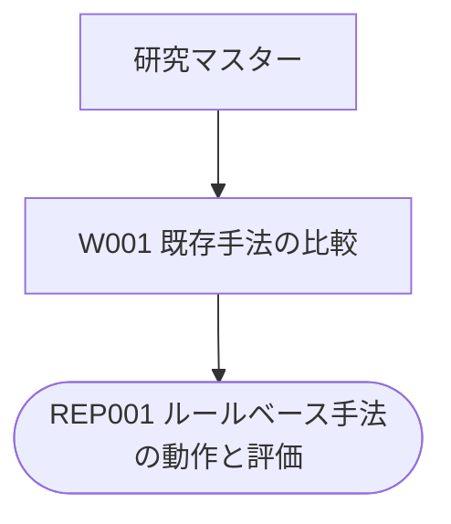

# 問いの木

自動生成（2026-10-07）。手で編集しない。`python3 research/src/make_flow.py` で作り直す。
問い 1 件 / REP（検証・探索）1 件。

## 一覧

- **W001 既存手法の比較** 【作業】
  - **REP001 ルールベース手法の動作と評価** 【REP】

## 図

```mermaid
graph TD
  ROOT[研究マスター]
  W001["W001 既存手法の比較"]
  ROOT --> W001
  REP001(["REP001 ルールベース手法の動作と評価"])
  W001 --> REP001
```
