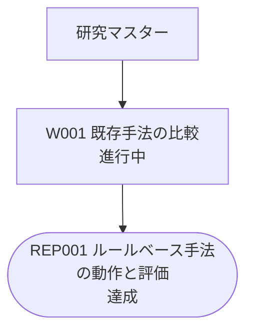

# 問いの木

自動生成（2026-10-07）。手で編集しない。`python3 research/src/make_flow.py` で作り直す。
問い 1 件 / REP（検証・探索）1 件。

## 一覧

- **W001 既存手法の比較** 【作業】 進行中  
  問いが立つ前の作業。既存手法（ルールベース）を動かして規模感・評価指標・特徴量の取り方を固める
  - **REP001 ルールベース手法の動作と評価** 【探索】 達成  
    ルールベース3手法（PID / ABid / OnlineLP）を動かし、規模感・論文との傾向の一致・最適化の余地・取るべき特徴量を確認する

## 図

