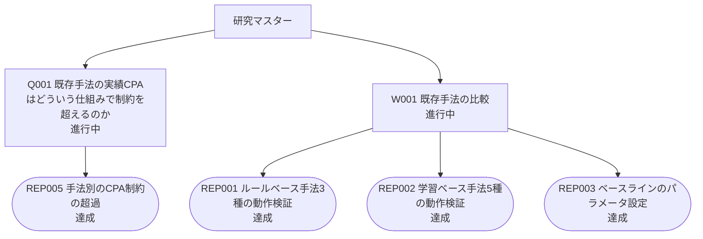

# 問いの木

自動生成（2026-10-09）。手で編集しない。`python3 research/src/make_flow.py` で作り直す。
問い 2 件 / REP（検証・探索）4 件。

## 一覧

- **Q001 既存手法の実績CPAはどういう仕組みで制約を超えるのか** 【問い】 進行中  
  既存手法の実績 CPA は、どういう仕組みで制約を超えるのか
  - **REP005 手法別のCPA制約の超過** 【探索】 達成  
    既存8手法について、CPA制約の超過がどの手法でどれだけ起きているかを、REP002 の結果から数える（新しい実験はしない）
- **W001 既存手法の比較** 【作業】 進行中  
  問いが立つ前の作業。既存手法（ルールベース3＋学習ベース5）を動かして、規模感とベースラインを固める
  - **REP001 ルールベース手法3種の動作検証** 【探索】 達成  
    ルールベース3手法（PID / ABid / OnlineLP）を動かし、規模感・論文との傾向の一致・最適化の余地・取るべき特徴量を確認する
  - **REP002 学習ベース手法5種の動作検証** 【探索】 達成  
    学習ベース5手法（BC / IQL / CQL / BCQ / TD3_BC）を公開データで学習し直し、REP001 と同じ条件で評価して、既存8手法のベースラインを作る
  - **REP003 ベースラインのパラメータ設定** 【探索】 達成  
    以後の比較に使う、既存8手法のベースラインのパラメータ設定（学習ベースは学習の長さなど）を、理屈と方策の出力の測定から決める

## 図

